# GWSW Geo

Stichting RIONED is initiatiefnemer en eigenaar van dit GitHub-project, Eric Oosterom is de verantwoordelijk projectmanager. 

Vragen over deze website en het GWSW kunt u stellen via gwsw@rioned.org. 

# GWSW Geo - Beschrijving wijzigingen versies

*Versie:*

*20250414 -- Aangepast hoofdstuk 3.1.4 Opmaken van dataset in ArcGIS
Pro*

*20240209 -- Afstemming GWSW 1.6, eerste Respec publicatie*

*20211108 - Toegevoegd hoofdstuk 3.1.3 en 3.1.4 Opmaken van datasets in
QGIS en ArcGIS*

*20211003 - Afstemming tabel met symbolen op GWSW release 1.5.2. Zie
hoofdstuk 2.3*

*20210802 - Toegevoegd hoofdstukken:*

> *3.3 Publiceren van GWSW dataset op PDOK,*
>
> *3.3.1 Testen van een nieuwe dataset,*
>
> *3.3.2 Toekennen gebruikersrechten aan gebruiker "PDOK".*

*20210521 - Tabel met symbolen bijgewerkt op basis werkgroepoverleggen*

*Geo-thema\'s gedetailleerd.*

> *Uitlevering PDOK gespecificeerd*

*20201027 - Geo-thema Default gewijzigd. Zie hoofdstuk 2.1*

*20200528 - Specificatie selecties per thema toegevoegd*

*20190924 - Andere hoofdstuk indeling, tekstcorrecties*

*20190909 - Reviews op symbologie verwerkt, eerste versie vastgesteld.
Zie hoofdstuk 2.3.*

*20190818 - Aangepaste URL voor nulmeting-resultaat.*

*20190311 - Nieuwe functie apps.gwsw.nl (menu-item GWSW Geo) opgenomen.
URL\'s opvragen GeoPackage opnieuw gecorrigeerd.*

*20190308 - URL\'s opvragen GeoPackage gecorrigeerd*

*20190307 - Hoofdstuk 1 anders ingedeeld. Optie GeoPackage toegevoegd.
Figuren GWSW Server bijgewerkt*

*20190107 - Tabel met relevante URI\'s verplaatst naar data.gwsw.nl*

*20181220 - Default symbolen voor onbekende objecten toegevoegd.
Symbooltabel nu gereed om ter visie te leggen.*

*20181002 - Opmerkingen werkgroep overleg dd 20181001*

*20180908 - Thema \"Nulmeting\" ipv ReportVali*

*20180830 - Uitwerking thema Kengetallen (op basis datastory met
Kadaster)*

*20180815 - Nieuwe URI strategie, eerste opzet generieke symbolen,
uitwerking GIS-thema\'s*

*20180509 - Opmerkingen werkgroep doorgevoerd: thema\'s ipv views,
laagindeling naar geometrievorm, symbolentabellen uitgebreid met alle
GWSW-types*

*20180508 - Symbolen Rotterdam toegevoegd*

*20180416 - Opmerkingen Mark verwerkt (zie ook mailing)*

*20180308 - Symbolen Sweco toegevoegd*

*20180227 - Specificatie GIS Views toegevoegd*

*20171011 - Tips voor gebruik QGIS*

*20170602 - URL's in tabel gecorrigeerd (geodata ipv data)*

*20170513 - Geactualiseerd (laatste ontwikkelingen verwerkt)*

*20170203 - Beschrijving Server en Geoserver samengevoegd*

*20170119 - Verbetering teksten*

*20170109 - Validatie-procedure*

*20161213 - Diverse aanvullingen*

*20161107 - Opmerkingen Matthé*

*20161106 - Eerste opzet*

# Inhoud

GWSW Geo - Beschrijving [1](#gwsw-geo---beschrijving)

1 Het Gegevenswoordenboek Stedelijk Water
[3](#het-gegevenswoordenboek-stedelijk-water)

1.1 Terminologie [4](#terminologie)

1.2 Applicatie GWSW Geo [5](#applicatie-gwsw-geo)

2 Inrichting GWSW Geo [7](#inrichting-gwsw-geo)

2.1 Geo-thema\'s op GWSW Datasets [7](#geo-themas-op-gwsw-datasets)

2.1.1 Specificaties van de Geo-thema\'s en GIS-lagen:
[7](#specificaties-van-de-geo-themas-en-gis-lagen)

2.1.2 Uitlevering naar PDOK [8](#uitlevering-naar-pdok)

2.1.3 Aanroep GWSW Geo (URI-strategie)
[9](#aanroep-gwsw-geo-uri-strategie)

2.2 GWSW Datasets als GeoPackage downloaden
[10](#gwsw-datasets-als-geopackage-downloaden)

2.2.1 Website GWSW Apps [10](#website-gwsw-apps)

2.2.2 REST API [10](#rest-api)

2.3 GWSW Symbolen [11](#gwsw-symbolen)

3 Toepassen van GWSW Geo [17](#toepassen-van-gwsw-geo)

3.1 GWSW Geo in de praktijk (voorbeelden met QGIS)
[17](#gwsw-geo-in-de-praktijk-voorbeelden-met-qgis)

3.1.1 WFS Protocol [17](#wfs-protocol)

3.1.2 Omvangrijke datasets in QGIS [18](#omvangrijke-datasets-in-qgis)

3.1.3 Testen met WFS [18](#opmaken-van-datasets-in-qgis)

3.1.4 Publicatie via PDOK [19](#publicatie-via-pdok)

3.2 Presenteren Nulmeting-resultaat
[20](#presenteren-nulmeting-resultaat)

3.3 Publiceren van GWSW dataset op PDOK
[20](#publiceren-van-gwsw-dataset-op-pdok)

3.3.1 Testen van een nieuwe dataset voorafgaand aan de doorlevering naar
PDOK
[20](#testen-van-een-nieuwe-dataset-voorafgaand-aan-de-doorlevering-naar-pdok)

3.3.2 Toekennen gebruikersrechten aan gebruiker "PDOK"
[21](#toekennen-gebruikersrechten-aan-gebruiker-pdok)

Bijlage: Inventarisatie gebruikte symbolen
[23](#bijlage-inventarisatie-gebruikte-symbolen)

**\
**

# Het Gegevenswoordenboek Stedelijk Water

Het Gegevenswoordenboek Stedelijk Water (GWSW) is een ontologie, een
speciale datastructuur die systemen (stelsels) en processen op het
gebied van stedelijk waterbeheer beschrijft.

Het GWSW is een open datastandaard volgens het linked data principe die
door Stichting RIONED namens de sector is ontwikkeld. Het is onderdeel
van het Semantisch Web en is gemodelleerd in RDF/RDFS/OWL-2. Meer
informatie daarover vindt u
https://www.riool.net/gegevenswoordenboek-stedelijk-water .

Sinds medio 2015 is bij Stichting RIONED de GWSW Server in bedrijf. Deze
semantische server staat onder beheer van RIONED en wordt gebruikt bij
proefnemingen voor het GWSW-project.

De server biedt de mogelijkheid om de GWSW-Ontologie in combinatie met
stedelijk-water-gegevens (zogenaamde datasets) te raadplegen, te
ontwikkelen en toe te passen.

Er zijn vijf websites op de GWSW Server geïnstalleerd:

1.  Raadplegen GWSW: [https://data.gwsw.nl](http://data.gwsw.nl) en
    [https://geodata.gwsw.nl](http://geodata.gwsw.nl)

2.  Ontwikkelen GWSW: <https://review.gwsw.nl/webprotege> (aanroep via
    data.gwsw.nl)

3.  Toepassen GWSW: [https://apps.gwsw.nl](http://apps.gwsw.nl) en
    <https://sparql.gwsw.nl>

De gangbare beheersystemen zijn of worden afgestemd op uitwisseling van
gegevens conform het GWSW-uitwisselingsprotocol OroX. Daarmee is het
mogelijk geworden om neutrale bronbestanden (met gemeentelijke gegevens)
en generieke functies in te richten. De GWSW-Server vervult daarin een
centrale rol. Stichting RIONED heeft deze server ingericht voor de brede
toepassing van het GWSW.

De GWSW Server vervult een rol als "SPARQL-endpoint", SPARQL is een
query-taal en service-protocol ontworpen voor de RDF/RDFS/OWL-2
database-taal. Daarmee kunnen (onder andere) gegevens vanaf de
GWSW-Server worden opgevraagd. Op dit "endpoint" zijn dus zowel de
ontologie als de brongegevens van gemeentes geïnstalleerd. Meer over het
gebruik van het SPARQL-endpoint vindt u op
[https://apps.gwsw.nl](http://apps.gwsw.nl) .

De GWSW Server is nu nog experimenteel van aard. Het SPARQL-endpoint kan
in de toekomst decentraal (bij bronhouders, regionaal) of centraal
(Kadaster, VNG, private partij of toch via Stichting RIONED)
geïnstalleerd worden. De GWSW ontologie blijft in beheer bij Stichting
RIONED en wordt centraal ontsloten.

## Terminologie

De GWSW ontologie is ingericht voor de discipline Stedelijk Water met de
beheerders als eerste doelgroep. De gebruikte termen in GWSW Geo zijn
uiteraard gebaseerd op de GWSW ontologie. Via de GIS views wordt echter
gekoppeld met andere disciplines en gebruikersgroepen, dat kan
verwarring in de betekenis van termen opleveren.

Het GWSW beschrijft éénduidig de gebruikte termen met bijhorende
definities. Hierna volgt een toelichting van enkele GWSW-concepten
waarvan de betekenis afhankelijk van de invalshoek mogelijk kan
verschillen.

**Rioleringsgebied**

De definitie volgens het GWSW (gedeeltelijk afgeleid van IRIS-RIOKEN):

*Het gebied waarbinnen één of meerdere inliggende rioolstelsel(s) het
afvalwater naar één gemaal of overnamepunt transporteert/teren. Een
rioleringsgebied kan een enkelvoudig gebied zijn, maar kan ook meerdere
rioleringsgebieden omvatten.*

*Een gebied is zodanig gekozen dat het voldoende inzicht geeft in de
belasting van oppervlaktewater en overnamepunt.*

De aanduiding \"gebied\" is hier belangrijk. In het GWSW is dit een
ruimtelijk object en wezenlijk verschillend van een fysiek object zoals
een rioolstelsel. Een ruimte kan een fysiek object \"bevatten\", een
rioleringsgebied bevat één of meerdere rioolstelsels.

Een rioleringsgebied kan ook andere rioleringsgebieden bevatten, het is
een ruim begrip.

**Bemalingsgebied**

In het GWSW is als definitie (conform de NEN 3300) opgenomen:

*Een rioleringsgebied waaruit het afvalwater door een gemaal wordt
verwijderd.*

Het is dus soort rioleringsgebied (een specialisatie daarvan), het
overnamepunt wordt in dit geval gevormd door een gemaal.

## Applicatie GWSW Geo

In november 2016 is de eerste versie van GWSW Geo gelanceerd. De
applicatie GWSW Geo levert ("serveert") op aanvraag gegevens in
geo-formaat vanuit de GWSW database. Voor het opvragen van deze gegevens
wordt een datasetnaam meegegeven, meestal de gemeentenaam.

GWSW Geo is op de achtergrond een NodeJS-applicatie (oorspronkelijk was
dat een Python-app) voor het uitvoeren van SPARQL queries en het
omzetten van gegevens naar een presentatiefo**r**maat. GWSW Geo bevraagt
het SPARQL-Endpoint, die serveert de gevraagde gegevens in JSON. Deze
gegevens worden door GWSW Geo vervolgens in GML-formaat afgeleverd.

De webservice is conform het WFS protocol ingericht. Dit protocol is
ontwikkeld door het Open Geospatial Consortium (OGC) en regelt het
berichtenverkeer van geografische (vector)gegevens.

Het WFS protocol wordt ook in Nederland breed toegepast, het platform
PDOK (publieke dienstverlening op de kaart) is daarvan een belangrijk
voorbeeld. Allerlei publieke gegevens zoals het Actueel Hoogtebestand
Nederland (AHN1/2) en de Basisregistratie Grootschalige Topografie (BGT)
zijn via WFS eenvoudig te op te vragen.

*Webservice-protocollen: WMS en WFS*

*Het Open Geospatial Consortium (OGC) heeft standaard protocollen voor
de uitwisseling van ruimtelijke informatie ontwikkeld.*

*Het WMS protocol staat voor Web Map Service, daarmee kunnen
kaartbeelden worden opgevraagd en kan per locatie (via een get-service)
objectinformatie worden geleverd.*

*Het WFS protocol staat voor Web Feature Service, daarmee kunnen de
individuele geo-objecten inclusief administratieve gegevens worden
opgevraagd. Daarmee kan het kaartbeeld achteraf, op basis van de
objectgegevens, worden opgemaakt en kunnen ruimtelijke analyses op de
objecten worden uitgevoerd. Het WFS protocol voorziet ook in
edit-mogelijkheden.*

*Voor GWSW Geo is de logische keus het WFS protocol maar dan wel in
readonly-modus. De GIS gebruiker kan de GWSW data niet wijzigen maar kan
wel analyses op een verzameling objecten uitvoeren.*

Zoals genoemd is het WFS protocol ontwikkeld voor de uitwisseling van
geografische vectordata. De data wordt als punt, lijn, vlak per
"feature" meegegeven. Het WFS is dus objectgericht, in tegenstelling tot
bijvoorbeeld het WMS protocol voor de uitwisseling van rasterdata.

De geografische brongegevens zijn in neutrale vorm op de GWSW Server
geïnstalleerd en op te vragen met het SPARQL Endpoint (applicatie
GraphDB). Met de querytaal SPARQL vraagt GWSW Geo de gegevens op en
levert deze vervolgens (als service) aan de klant.

Het WFS protocol beschrijft de wijze van uitwisseling met
gestandaardiseerde vragen ("requests") en antwoorden. GWSW Geo handelt
de volgende WFS-requests af:

1.  GetCapabilities -- GWSW Geo retourneert (in xml-vorm) een overzicht
    van de beschikbare gestandaardiseerde vragen.

2.  DescribeFeatureType -- GWSW Geo retourneert (in xsd-vorm) de
    definitie van de te leveren GML-bestanden. Bijvoorbeeld welke
    kenmerken per "feature" meegeleverd worden.

3.  Getfeature -- GWSW Geo maakt en verstuurt een GML-bestand met de
    gevraagde gegevensset.

De requests worden naar de URL van GWSW Geo verstuurd, het
standaardadres is

<https://geodata.gwsw.nl/>

Op basis van de vraagstelling en de te gebruiken opslaglokatie wordt
vervolgens een GML-bestand aangemaakt en geretourneerd naar de
vraagsteller. De GML-vorm waarin de gegevens uiteindelijk worden
geleverd is een XML-bestand gericht op de uitwisseling van geografische
gegevens (GML = Geography Markup Language).

# Inrichting GWSW Geo

## Geo-thema\'s op GWSW Datasets

De applicatie GWSW Geo levert ("serveert") op aanvraag GWSW-gegevens
conform het breed toegepaste WFS protocol. GWSW Geo biedt daarbij een
keuze uit een aantal presentatievormen (thema\'s of in GIS-termen
\"group-layers\") die door middel van queries ("gestandaardiseerde
vragen") afgeleid worden van de datasets op de GWSW Server.

Afhankelijk van de eindgebruiker zijn er zeven thema\'s gedefinieerd:

<table>
<colgroup>
<col style="width: 20%" />
<col style="width: 20%" />
<col style="width: 59%" />
</colgroup>
<thead>
<tr class="header">
<th>Geo-thema</th>
<th>Doelgroep</th>
<th>Omschrijving</th>
</tr>
</thead>
<tbody>
<tr class="odd">
<td>
Default

(zonder naam)
</td>
<td>Adviseurs, databeheerders</td>
<td>Volledige weergave van de gangbare dataset-inhoud. Bevat alle objecten met een geometrie.</td>
</tr>
<tr class="even">
<td>Beheer</td>
<td>
Beheerders in de

afvalwaterketen
</td>
<td>Gebieden, hoofdriolering, overstorten, uitlaten, gemalen, randvoorzieningen. Met een uitgebreide set kenmerken.</td>
</tr>
<tr class="odd">
<td>

PDOK

Stedelijk Water
</td>
<td>
PDOK publicatie

Stedelijk Water
</td>
<td>Gebieden, hoofdriolering, overstorten, uitlaten, gemalen, randvoorzieningen. Met een uitgebreide set kenmerken.</td>
</tr>
<tr class="even">
<td>Netwerk</td>
<td>Modelleur</td>
<td>Netwerkweergave (knooppunten, verbindingen) voor modelinstumentaria</td>
</tr>
<tr class="odd">
<td>Aansluiting</td>
<td>Inwoners</td>
<td>Aansluitleidingen perceel en kolk</td>
</tr>
<tr class="even">
<td>Waterschap</td>
<td>
PDOK publicatie

Waterketen
</td>
<td>Gebieden, hoofdriolering, overstorten, uitlaten, gemalen, randvoorzieningen. Met een uitgebreide set kenmerken.</td>
</tr>
<tr class="odd">
<td>Nulmeting</td>
<td>Databeheerders</td>
<td>Rapportage nulmeting.</td>
</tr>
</tbody>
</table>

In de volgende paragrafen zijn de details van de Geo-thema\'s
beschreven.

### Specificaties van de Geo-thema\'s en GIS-lagen:
<table style="width:100%;">
<colgroup>
<col style="width: 12%" />
<col style="width: 23%" />
<col style="width: 26%" />
<col style="width: 8%" />
<col style="width: 21%" />
<col style="width: 7%" />
</colgroup>
<thead>
<tr class="header">
<th>GIS-laag</th>
<th>Omschrijving inhoud</th>
<th colspan="2">Specificatie selectie</th>
<th>Attributen</th>
<th>Geo-metrie</th>
</tr>
</thead>
<tbody>
<tr class="odd">
<td colspan="3"><em>Geo-thema Default: URL =</em> <em>https://geodata.gwsw.nl/{dataset}</em></td>
<td></td>
<td></td>
<td></td>
</tr>
<tr class="even">
<td colspan="6">
Het thema Default is bedoeld om de inhoud van gangbare GWSW-datasets zo volledig mogelijk weer te geven, bijvoorbeeld ter controle van de opbouw. Voor inrichting van het thema Default zijn de volgende uitgangspunten gehanteerd:

<ol type="1">
<li>
Toon alle individuen met een geometrie
</li>
<li>
Toon de gangbare kenmerken van die individuen
</li>
<li>
Toon de onderdelen van die individuen met de gangbare kenmerken
</li>
<li>
Gebruik zoveel mogelijk de basisopbouw uit de dataset, zonder bewerkingen.
</li>
</ol></td>
</tr>
<tr class="odd">
<td>Buitengrens</td>
<td>Gebied, bouwwerk, put, …</td>
<td colspan="2">Individuen met kenmerk gwsw:Buitengrens</td>
<td>Alle in datasets gangbare attributen</td>
<td>Buiten-grens</td>
</tr>
<tr class="even">
<td>Punt_deel</td>
<td>Deksel, Overstortdrempel, Pomp, …</td>
<td colspan="2">Onderdelen van de indivduen met kenmerk gwsw:Punt</td>
<td>Alle in datasets gangbare attributen</td>
<td>Punt</td>
</tr>
<tr class="odd">
<td>Punt</td>
<td>Put, bouwwerk, …</td>
<td colspan="2">Individuen met kenmerk gwsw:Punt</td>
<td>Alle in datasets gangbare attributen</td>
<td>Punt</td>
</tr>
<tr class="even">
<td>Lijn</td>
<td>Leiding, …</td>
<td colspan="2">Individuen met kenmerk gwsw:Lijn</td>
<td>Alle in datasets gangbare attributen</td>
<td>Lijn</td>
</tr>
<tr class="odd">
<td></td>
<td></td>
<td colspan="2"></td>
<td></td>
<td></td>
</tr>
<tr class="even">
<td colspan="3"><em>Geo-thema Beheer: URL = https://geodata.gwsw.nl/{dataset}/beheer</em></td>
<td></td>
<td></td>
<td></td>
</tr>
<tr class="odd">
<td>Gebied</td>
<td>Gebied, systeem, stelsel</td>
<td colspan="2">Alle individuen met kenmerk gwsw:Gebiedsorientatie</td>
<td>Conform GWSW-MDS</td>
<td>Buiten-grens</td>
</tr>
<tr class="even">
<td>Put</td>
<td>Rioolput</td>
<td colspan="2">Individuen van het type (subtype van) gwsw:Rioolput.</td>
<td>Conform GWSW-MDS</td>
<td>Punt</td>
</tr>
<tr class="odd">
<td>Leiding</td>
<td>Leiding in de hoofdriolering</td>
<td colspan="2">Individuen van het type (subtype van) gwsw:Leiding uitgezonderd (subtype van) gwsw:Aansluitleiding en (subtype van) gwsw:Goot.</td>
<td>Conform GWSW-MDS</td>
<td>Lijn</td>
</tr>
<tr class="even">
<td>Lozing</td>
<td>Constructie met externe lozing</td>
<td colspan="2">Individuen van het type gwsw:ExterneOverstortput of gwsw:Overstortput of (subtype van) gwsw:Uitlaatconstructie.</td>
<td>Conform GWSW-MDS</td>
<td>Punt</td>
</tr>
<tr class="odd">
<td>Pomp</td>
<td>Constructie met pomp</td>
<td colspan="2">Individuen van het type (subtype van) gwsw:Pompput of (subtype van) gwsw:Gemaal of individuen die als deel een (subtype van) gwsw:Pomp hebben.</td>
<td>Conform GWSW-MDS</td>
<td>Punt</td>
</tr>
<tr class="even">
<td>Bouwwerk</td>
<td>Randvoorziening, RWZI</td>
<td colspan="2">Individuen van het type (subtype van) gwsw:Bouwwerk</td>
<td>Conform GWSW-MDS</td>
<td>Punt</td>
</tr>
<tr class="odd">
<td></td>
<td></td>
<td colspan="2"></td>
<td></td>
<td></td>
</tr>
<tr class="even">
<td colspan="3"><em>Geo-thema Netwerk: URL =</em> <em>https://geodata.gwsw.nl/{dataset}/netwerk</em></td>
<td></td>
<td></td>
<td></td>
</tr>
<tr class="odd">
<td>Knooppunt</td>
<td>Put, compartiment, uitlaat</td>
<td colspan="2">
Individuen van het type (subtype van) gwsw:Rioolput of (subtype van) gwsw:Kolk of (subtype van) gwsw:Bouwwerk.

<mark>P.M.</mark>

<mark>Moet Kolk er wel in?</mark>

<mark>Niet alle bouwwerken horen erbij</mark>
</td>
<td>Conform GWSW-Hyd</td>
<td>Punt</td>
</tr>
<tr class="even">
<td>Verbinding</td>
<td>Leiding, pomp, wand</td>
<td colspan="2">
Individuen van het type (subtype van) gwsw:Leiding.

<mark>P.M. Nog aanscherpen?</mark>
</td>
<td>Conform GWSW-Hyd</td>
<td>Lijn</td>
</tr>
<tr class="odd">
<td>Kunstwerk</td>
<td>Hydraulisch component pomp, wand, …</td>
<td colspan="2">Individuen van het type gwsw:UitlaatPunt en individuen (onderdelen) van het type (subtype van) gwsw:Doorlaat of een (subtype van) gwsw:Pomp of een (subtype van) gwsw:Overstortdrempel.</td>
<td>Conform GWSW-Hyd</td>
<td>Punt</td>
</tr>
<tr class="even">
<td></td>
<td></td>
<td colspan="2"></td>
<td></td>
<td></td>
</tr>
<tr class="odd">
<td colspan="3"><em>Geo-thema Aansluiting: URL =</em> <em>https://geodata.gwsw.nl/{dataset}/aansluiting</em></td>
<td></td>
<td></td>
<td></td>
</tr>
<tr class="even">
<td>Aansluiting</td>
<td>Inlaat bij aansluiting</td>
<td colspan="2">Individuen van het type (subtype van) gwsw:Inlaat die deel zijn een (subtype van) gwsw:Aansluiting.</td>
<td>Stelsel, Naam, Subtype, Datum, Materiaal, Afmetingen</td>
<td>Punt</td>
</tr>
<tr class="odd">
<td>Aansluiting_Put</td>
<td>Put en hulpstukken bij aansluiting</td>
<td colspan="2">Individuen die deel zijn van een (subtype van) gwsw:Aansluiting en het kenmerk gwsw:Punt hebben</td>
<td></td>
<td>Punt</td>
</tr>
<tr class="even">
<td>Aansluiting_Leiding</td>
<td>Aansluitleiding, goot</td>
<td colspan="2">Individuen van het type (subtype van) gwsw:Aansluitleiding of (subtype van) gwsw:Goot</td>
<td></td>
<td>Lijn</td>
</tr>
<tr class="odd">
<td></td>
<td></td>
<td colspan="2"></td>
<td></td>
<td></td>
</tr>
<tr class="even">
<td colspan="3"><em>Geo-thema</em> <em>Kentallen: URL =</em> <em>https://geodata.gwsw.nl/{dataset}/kengetallen</em></td>
<td></td>
<td></td>
<td></td>
</tr>
<tr class="odd">
<td>Gebied</td>
<td>Rioleringsgebied</td>
<td colspan="2"><mark>P.M. (nog uitwerken, wordt herzien in GWSW 1.6)</mark></td>
<td>Naam, LengteLeidingen, Buurten + conform GWSW-RioKen</td>
<td>Buiten-grens</td>
</tr>
<tr class="even">
<td>Buurt</td>
<td>Buurt met CBS-gegevens</td>
<td colspan="2"><mark>P.M. (nog uitwerken, wordt herzien in GWSW 1.6)</mark></td>
<td>Naam, Rioleringsgebied, Gemeente, Wijk, AantalInwoners, AantalHuishoudens, AantalBedrijven, AantalRecreatie</td>
<td>Buiten-grens</td>
</tr>
<tr class="odd">
<td></td>
<td></td>
<td colspan="2"></td>
<td></td>
<td></td>
</tr>
<tr class="even">
<td colspan="3"><em>Geo-thema Nulmeting: URL =</em> <em>https://geodata.gwsw.nl/{dataset}/nulmeting</em></td>
<td></td>
<td></td>
<td></td>
</tr>
<tr class="odd">
<td>Put</td>
<td>Put in rapport Nulmeting</td>
<td colspan="2">Rapportmeldingen van het type vali:Violation en de property vali:punt</td>
<td>Naam, Subtype, Type melding, Kenmerk, Opmerking</td>
<td>Punt</td>
</tr>
<tr class="even">
<td>Leiding</td>
<td>Leiding in rapport Nulmeting</td>
<td colspan="2">Rapportmeldingen van het type vali:Violation en de property vali:lijn</td>
<td>Naam, Subtype, Type melding, Kenmerk, Opmerking</td>
<td>Lijn</td>
</tr>
<tr class="odd">
<td></td>
<td></td>
<td colspan="2"></td>
<td></td>
<td></td>
</tr>
</tbody>
</table>

### Uitlevering naar PDOK 

De GWSW Server heeft een verbinding met het PDOK platform. Op dit moment staat op PDOK de dataset Stedelijk Water (ook riolering), waarin het Geo-thema Beheer is opgenomen.

Vanaf GWSW 1.6 start ook een proefneming met de uitlevering van aansluiting-gegevens, van enkele gemeenten (waaronder Den Haag) zijn die gegevens nu beschikbaar.

Daarnaast is er de wens van het Waterschapshuis om de gegevens van de afvalwaterketen op een duidelijker plek (dataset) binnen PDOK te plaatsen.

In de volgende tabel is een voorstel voor de PDOK presentatie opgenomen.

<table>
<colgroup>
<col style="width: 33%" />
<col style="width: 46%" />
<col style="width: 20%" />
</colgroup>
<thead>
<tr class="header">
<th>PDOK dataset</th>
<th>Opgenomen lagen (thema:laagnaam)</th>
<th></th>
</tr>
</thead>
<tbody>
<tr class="odd">
<td>
Stedelijk Water (ook riolering)

(uitlevering inclusief Waterschapsgegevens)
</td>
<td>
Beheer:Gebied

Beheer:Bouwwerk

Beheer:Put

Beheer:Leiding

Aansluiting:Aansluiting_Leiding
</td>
<td></td>
</tr>
<tr class="even">
<td>
Waterschappen Afvalwaterketen

(uitlevering Waterschapsgegevens)
</td>
<td>In ontwikkeling ism het Waterschapshuis</td>
<td></td>
</tr>
</tbody>
</table>

### Uitlevering naar PDOK 

De GWSW Server heeft een verbinding met het PDOK platform. Op dit moment
staat op PDOK de dataset Stedelijk Water (ook riolering), waarin het
Geo-thema Beheer is opgenomen.

Vanaf GWSW 1.6 start ook een proefneming met de uitlevering van
aansluiting-gegevens, van enkele gemeenten (waaronder Den Haag) zijn die
gegevens nu beschikbaar.

Daarnaast is er de wens van het Waterschapshuis om de gegevens van de
afvalwaterketen op een duidelijker plek (dataset) binnen PDOK te
plaatsen.

In de volgende tabel is een voorstel voor de PDOK presentatie opgenomen.

<table>
<colgroup>
<col style="width: 33%" />
<col style="width: 46%" />
<col style="width: 20%" />
</colgroup>
<thead>
<tr class="header">
<th>PDOK dataset</th>
<th>Opgenomen lagen (thema:laagnaam)</th>
<th></th>
</tr>
</thead>
<tbody>
<tr class="odd">
<td>
Stedelijk Water (ook riolering)

(uitlevering inclusief Waterschapsgegevens)
</td>
<td>
Beheer:Gebied

Beheer:Bouwwerk

Beheer:Put

Beheer:Leiding

Aansluiting:Aansluiting_Leiding
</td>
<td></td>
</tr>
<tr class="even">
<td>
Waterschappen Waterketen

(uitlevering Waterschapsgegevens)
</td>
<td>In ontwikkeling ism het Waterschapshuis</td>
<td></td>
</tr>
</tbody>
</table>

### Aanroep GWSW Geo (URI-strategie)

De basis URL voor de aanroep van GWSW Geo is
[https://geodata.gwsw.nl/{dataset}](https://geodata.gwsw.nl/%7bdataset%7d)
.

Hierin wordt de term {dataset} vervangen door de naam van de betreffende
opslagplaats op de GWSW Server, vaak een gemeentenaam. Standaard wordt
uitgegaan van een aanvraag conform het WFS-protocol, vooralsnog wordt
ook alleen dat protocol ondersteund. De aanvraag
[https://geodata.gwsw.nl/{dataset}](https://geodata.gwsw.nl/%7bdataset%7d)
wordt geïnterpreteerd als
[https://geodata.gwsw.nl/{dataset}?service=WFS](https://geodata.gwsw.nl/%7bdataset%7d?service=WFS)
.

*Let op, de dataset-namen zijn hoofdletter-gevoelig, de naam \"juinen\"
verwijst naar een andere dataset dan die onder de naam \"Juinen\". De
database-beheerder zal echter in de praktijk dat soort dubbelingen
vermijden.*

Aan de URL worden submappen toegevoegd om de verschillende thema\'s te
benaderen. Zie voor de submapnaam de kolom \"Thema\" in de vorige tabel.
Bijvoorbeeld het thema \"netwerk\" wordt geselecteerd met de URL:
[https://geodata.gwsw.nl/{dataset}/netwerk](https://geodata.gwsw.nl/%7bdataset%7d/netwerk)
.

Elk thema bestaat vervolgens uit één of meer GIS-lagen. Deze lagen zijn
ingedeeld naar de object- en geometriesoort: punten (putten, uitlaten,
pompputten, reservoirs), lijnen (leidingen) en vlakken (gebieden).
Objecten met gelijke geometriesoort en een grote overeenkomst in
attributen worden gebundeld in een GIS-laag.

## GWSW Datasets als GeoPackage downloaden

Een GeoPackage bevat een gestandaardiseerde opslag van geografische data
in een SQLite database-container. Het kan zowel vector- als rasterdata
bevatten. Net als het WFS protocol is ook GeoPackage een ontwikkeling
van het Open Geospatial Consortium (OGC). Een GeoPackage bestaat fysiek
uit één bestand met de extensie .gpkg. De gangbare GIS\'en kunnen een
GeoPackage laden, die optie staat dan vaak onder menu-items als \"Open
database\".

De GWSW Server levert een GeoPackage-bestand op basis van de opgegeven
GWSW Dataset. Ook hier zijn de Geo-thema\'s toepasbaar (zie vorige
paragraaf).

### Website GWSW Apps

Een verzoek aan de GWSW-server voor levering van een GeoPackage-bestand
gebeurt op [https://apps.gwsw.nl](http://apps.gwsw.nl/) , onder
menu-item GWSW Geo. Op basis van de GWSW Dataset en het gewenste
Geo-thema downloadt u een GeoPackage-bestand.

### REST API

Dezelfde functionaliteit is ook beschikbaar als REST service, voor de
rechtstreekse aanroep vanuit een webbrowser of andere applicaties
gebruikt u de volgende aanroepen:

[P.M. :]{.mark} [Nog uitwerken conform OAS3]{.mark}

Een GeoPackage wordt bij de GWSW Server opgevraagd met:

> HTTP **method** = GET
>
> **URL** =
> [https://geodata.gwsw.nl/{dataset}\[/{thema}\]](https://geodata.gwsw.nl/%7bdataset%7d%5b/%7bthema%7d%5d?request=getGeoPackage)?request=getGeoPackage
> . Het Geo-thema is ook hier optioneel, als het ontbreekt wordt het
> default thema gebruikt.
>
> **Response**-inhoud bij HTTP 200 = HTML string met een proces-id, de
> proces-status en de URL voor de vervolgaanvraag. De proces-status kan
> zijn \"running\" of \"error\".

Met het proces-id (een nummer) is de status van de bewerking op te
vragen:

> HTTP **method** = GET
>
> **URL** =
> [https://geodata.gwsw.nl/{dataset}\[/{thema}\]?request=getGeoPackage&process={proces-id}](https://geodata.gwsw.nl/%7bdataset%7d%5b/%7bthema%7d%5d?request=getGeoPackage&process=%7bproces-id%7d)
> .
>
> **Response**-inhoud bij HTTP 200 = HTML string met een proces-id, de
> proces-status en de URL voor de vervolgaanvraag. De proces-status kan
> zijn \"running\", \"error\" of \"succeeded\".

Als de status \"succeeded\" is bereikt wordt het GeoPackage opgevraagd:

> HTTP **method** = GET
>
> **URL** =
> [https://geodata.gwsw.nl/{dataset}\[/{thema}\]?request=getGeoPackage&process={proces-id}](https://geodata.gwsw.nl/%7bdataset%7d%5b/%7bthema%7d%5d?request=getGeoPackage&process=%7bproces-id%7d)&download
> .
>
> **Response**-inhoud bij HTTP 200 = Binair bestand Geopackage.

## GWSW Symbolen

In de bijlage staat een globale inventarisatie van de in gebruik zijnde
symbolen binnen het vakgebied Stedelijk Water. Die verzameling toont aan
dat er geen sprake is van (nationale) consensus over de toepassing van
deze symbolen. Met de GWSW Symbolen willen we die brede consensus wel
bereiken.

*Uitgangspunten*

-   De GWSW Symbolen omvatten de symbolen voor objecten met
    punt-geometrie, de kleuren en lijndikte voor objecten met
    lijn-geometrie en de inkleuring van objecten met vlak-geometrie

-   De GWSW Symbolen zijn altijd gekoppeld aan het objecttype, alleen
    dat objecttype bepaalt het te hanteren symbool

-   De GWSW Symbolen zijn afgestemd op geografische presentaties op
    globale schaal. Bij gedetailleerde GIS-presentaties is het
    bijvoorbeeld mogelijk om bij inzoomen te variëren in lijntype zodat
    de kleuren niet meer het enige onderscheid vormen. Voor GWSW Geo,
    gericht op GIS presentaties, is vooralsnog gekozen om eenvoudige
    basisvormen voor de meest voorkomende objecttypes aan te houden. We
    gaan uit van een presentatie op globale schaal.

Uit de uitgangspunten wordt al duidelijk dat de GWSW Symbolen zich
beperken tot de basisvorm. Er is natuurlijk altijd ruimte voor externe
applicaties om de geo-stijl verder uit te werken in combinatie met de
gewenste GIS-analyse.

***Afstemming op de Nederlandse CAD Standaard voor de GWW-sector
(NLCS)***

*Zie voor het NLCS: <https://www.gww-nlcs.nl/>*

*De gehanteerde lijnkleuren bij leidingtypes zijn conform de NLCS, waar
nodig aangevuld met nieuwe leidingtypes waar de NLCS op wordt afgestemd.
In dat laatste geval is dat in de tabel vermeld.*

*De NLCS-lijntypes zijn specifiek op CAD afgestemd, die zijn minder
bruikbaar voor GIS presentaties met GWSW Geo. Voor GWSW Geo gebruiken we
alleen de doorgetrokken lijn.*

*De putsymbolen zijn afgestemd op de meest voorkomende in
schematekeningen ('best practice"). De NLCS-putsymbolen zijn specifiek
op CAD afgestemd, die zijn minder bruikbaar voor GIS presentaties met
GWSW Geo.*

*Voor de terminologie van puttypes en leidingtypes is het GWSW leidend,
de NLCS wordt hierop afgestemd.*

De volgende tabel bevat de GWSW Geo Symbolen per Geo-thema. Aan enkele
put- en leidingtypes is nog geen uniek symbool of lijntype toegekend,
daarvoor geldt vooralsnog het default symbool of lijntype. Wijzigingen
in presentaties tov de voorgaande versie van het document zijn in rood
aangegeven

<table>
<colgroup>
<col style="width: 33%" />
<col style="width: 3%" />
<col style="width: 3%" />
<col style="width: 3%" />
<col style="width: 6%" />
<col style="width: 18%" />
<col style="width: 9%" />
<col style="width: 7%" />
<col style="width: 9%" />
<col style="width: 6%" />
</colgroup>
<thead>
<tr class="header">
<th>Objecttypes</th>
<th colspan="3">In Geo-thema</th>
<th>Sym-bool</th>
<th>GIS Stijl</th>
<th>Lijnkleur RGB</th>
<th>Lijndikte</th>
<th>
Opvulkleur

RGB
</th>
<th>Afme-ting</th>
</tr>
</thead>
<tbody>
<tr class="odd">
<td></td>
<td>be-heer</td>
<td>
net-

werk
</td>
<td>
aan-

sluit.
</td>
<td></td>
<td></td>
<td></td>
<td></td>
<td></td>
<td></td>
</tr>
<tr class="even">
<td></td>
<td></td>
<td></td>
<td></td>
<td></td>
<td></td>
<td></td>
<td></td>
<td></td>
<td></td>
</tr>
<tr class="odd">
<td>Gebieden (vlakken)</td>
<td></td>
<td></td>
<td></td>
<td></td>
<td></td>
<td></td>
<td></td>
<td></td>
<td></td>
</tr>
<tr class="even">
<td>Afwateringsgebied</td>
<td></td>
<td></td>
<td></td>
<td></td>
<td></td>
<td></td>
<td></td>
<td></td>
<td></td>
</tr>
<tr class="odd">
<td>Bemalingsgebied</td>
<td></td>
<td></td>
<td></td>
<td></td>
<td>Polygoon</td>
<td>0 0 0</td>
<td>1,0</td>
<td>transparant</td>
<td></td>
</tr>
<tr class="even">
<td>Gemeentelijk gebied</td>
<td></td>
<td></td>
<td></td>
<td></td>
<td></td>
<td></td>
<td></td>
<td></td>
<td></td>
</tr>
<tr class="odd">
<td>Industrieterrein</td>
<td></td>
<td></td>
<td></td>
<td></td>
<td></td>
<td></td>
<td></td>
<td></td>
<td></td>
</tr>
<tr class="even">
<td>Kern</td>
<td></td>
<td></td>
<td></td>
<td></td>
<td></td>
<td></td>
<td></td>
<td></td>
<td></td>
</tr>
<tr class="odd">
<td>Kwetsbaar gebied</td>
<td></td>
<td></td>
<td></td>
<td></td>
<td></td>
<td></td>
<td></td>
<td></td>
<td></td>
</tr>
<tr class="even">
<td>Rioleringsgebied</td>
<td></td>
<td></td>
<td></td>
<td></td>
<td>Polygoon</td>
<td>0 0 0</td>
<td>1,0</td>
<td>transparant</td>
<td></td>
</tr>
<tr class="odd">
<td>Risicogebied</td>
<td></td>
<td></td>
<td></td>
<td></td>
<td></td>
<td></td>
<td></td>
<td></td>
<td></td>
</tr>
<tr class="even">
<td>Stedelijk gebied</td>
<td></td>
<td></td>
<td></td>
<td></td>
<td></td>
<td></td>
<td></td>
<td></td>
<td></td>
</tr>
<tr class="odd">
<td>Stuwgebied</td>
<td></td>
<td></td>
<td></td>
<td></td>
<td>Polygoon</td>
<td>0 0 0</td>
<td>1,0</td>
<td>transparant</td>
<td></td>
</tr>
<tr class="even">
<td>Waterschapsgebied</td>
<td></td>
<td></td>
<td></td>
<td></td>
<td></td>
<td></td>
<td></td>
<td></td>
<td></td>
</tr>
<tr class="odd">
<td>Woonwijk</td>
<td></td>
<td></td>
<td></td>
<td></td>
<td></td>
<td></td>
<td></td>
<td></td>
<td></td>
</tr>
<tr class="even">
<td>Zuiveringseenheid</td>
<td></td>
<td></td>
<td></td>
<td></td>
<td>Polygoon</td>
<td></td>
<td>2,5</td>
<td>160 200 227</td>
<td></td>
</tr>
<tr class="odd">
<td>Systemen (vlakken)</td>
<td></td>
<td></td>
<td></td>
<td></td>
<td></td>
<td></td>
<td></td>
<td></td>
<td></td>
</tr>
<tr class="even">
<td>Afvalwatersysteem</td>
<td></td>
<td></td>
<td></td>
<td></td>
<td></td>
<td></td>
<td></td>
<td></td>
<td></td>
</tr>
<tr class="odd">
<td>Gescheiden systeem</td>
<td></td>
<td></td>
<td></td>
<td></td>
<td></td>
<td>0 0 0 (25%)</td>
<td>1</td>
<td>204 0 204 (25%)</td>
<td></td>
</tr>
<tr class="even">
<td>Verbeterd gescheiden systeem</td>
<td></td>
<td></td>
<td></td>
<td></td>
<td></td>
<td>0 0 0 (25%)</td>
<td>1</td>
<td>50 160 50 (25%)</td>
<td></td>
</tr>
<tr class="odd">
<td>Grondwatersysteem</td>
<td></td>
<td></td>
<td></td>
<td></td>
<td></td>
<td></td>
<td></td>
<td></td>
<td></td>
</tr>
<tr class="even">
<td>Meetinrichting</td>
<td></td>
<td></td>
<td></td>
<td></td>
<td></td>
<td></td>
<td></td>
<td></td>
<td></td>
</tr>
<tr class="odd">
<td>Oppervlaktewatersysteem</td>
<td></td>
<td></td>
<td></td>
<td></td>
<td></td>
<td></td>
<td></td>
<td></td>
<td></td>
</tr>
<tr class="even">
<td>Regelinrichting</td>
<td></td>
<td></td>
<td></td>
<td></td>
<td></td>
<td></td>
<td></td>
<td></td>
<td></td>
</tr>
<tr class="odd">
<td></td>
<td></td>
<td></td>
<td></td>
<td></td>
<td></td>
<td></td>
<td></td>
<td></td>
<td></td>
</tr>
<tr class="even">
<td>Stelsels (vlakken)</td>
<td></td>
<td></td>
<td></td>
<td></td>
<td></td>
<td></td>
<td></td>
<td></td>
<td></td>
</tr>
<tr class="odd">
<td>Drainagestelsel</td>
<td></td>
<td></td>
<td></td>
<td></td>
<td></td>
<td></td>
<td></td>
<td></td>
<td></td>
</tr>
<tr class="even">
<td>Duikerstelsel</td>
<td></td>
<td></td>
<td></td>
<td></td>
<td></td>
<td></td>
<td></td>
<td></td>
<td></td>
</tr>
<tr class="odd">
<td>Grondwatermeetnet</td>
<td></td>
<td></td>
<td></td>
<td></td>
<td></td>
<td></td>
<td></td>
<td></td>
<td></td>
</tr>
<tr class="even">
<td>Infiltratiestelsel</td>
<td></td>
<td></td>
<td></td>
<td></td>
<td></td>
<td></td>
<td></td>
<td></td>
<td></td>
</tr>
<tr class="odd">
<td>Drukriolering</td>
<td></td>
<td></td>
<td></td>
<td></td>
<td></td>
<td>255 0 255 (25%)</td>
<td>1</td>
<td>204 0 204</td>
<td></td>
</tr>
<tr class="even">
<td>Hybride systeem</td>
<td></td>
<td></td>
<td></td>
<td></td>
<td></td>
<td></td>
<td></td>
<td></td>
<td></td>
</tr>
<tr class="odd">
<td>Luchtpersriolering</td>
<td></td>
<td></td>
<td></td>
<td></td>
<td></td>
<td></td>
<td></td>
<td></td>
<td></td>
</tr>
<tr class="even">
<td>Vacuümriolering</td>
<td></td>
<td></td>
<td></td>
<td></td>
<td></td>
<td>255 127 255</td>
<td>1</td>
<td>255 127 255</td>
<td></td>
</tr>
<tr class="odd">
<td>Gemengd stelsel</td>
<td></td>
<td></td>
<td></td>
<td></td>
<td></td>
<td>0 0 0</td>
<td>1</td>
<td>255 127 0 (25%)</td>
<td></td>
</tr>
<tr class="even">
<td>Hemelwaterstelsel</td>
<td></td>
<td></td>
<td></td>
<td></td>
<td></td>
<td>0 0 0</td>
<td>1</td>
<td>160 206 227 (50%)</td>
<td></td>
</tr>
<tr class="odd">
<td>Onderbemaling</td>
<td></td>
<td></td>
<td></td>
<td></td>
<td></td>
<td>0 0 0</td>
<td>1</td>
<td>transparant</td>
<td></td>
</tr>
<tr class="even">
<td>Vuilwaterstelsel</td>
<td></td>
<td></td>
<td></td>
<td></td>
<td></td>
<td>0 0 0</td>
<td>1</td>
<td>255 0 0 (25%)</td>
<td></td>
</tr>
<tr class="odd">
<td>Persleidingsysteem</td>
<td></td>
<td></td>
<td></td>
<td></td>
<td></td>
<td></td>
<td></td>
<td></td>
<td></td>
</tr>
<tr class="even">
<td>Vrijverval transportstelsel</td>
<td></td>
<td></td>
<td></td>
<td></td>
<td></td>
<td></td>
<td></td>
<td></td>
<td></td>
</tr>
<tr class="odd">
<td>Absoluut rioolstelsel</td>
<td></td>
<td></td>
<td></td>
<td></td>
<td></td>
<td>0 0 0</td>
<td>1</td>
<td>255 127 0 (50%)</td>
<td></td>
</tr>
<tr class="even">
<td>Putten (symbolen)</td>
<td></td>
<td></td>
<td></td>
<td></td>
<td></td>
<td></td>
<td></td>
<td></td>
<td></td>
</tr>
<tr class="odd">
<td></td>
<td></td>
<td></td>
<td></td>
<td></td>
<td></td>
<td></td>
<td></td>
<td></td>
<td></td>
</tr>
<tr class="even">
<td>Default (alle putten, indien symbool onbekend)</td>
<td></td>
<td></td>
<td></td>
<td></td>
<td>Cirkel, gevuld</td>
<td>185 185 185</td>
<td>1</td>
<td></td>
<td>6</td>
</tr>
<tr class="odd">
<td></td>
<td></td>
<td></td>
<td></td>
<td></td>
<td></td>
<td></td>
<td></td>
<td></td>
<td></td>
</tr>
<tr class="even">
<td>Beerput</td>
<td></td>
<td></td>
<td></td>
<td></td>
<td></td>
<td></td>
<td></td>
<td></td>
<td></td>
</tr>
<tr class="odd">
<td>Bijzondere putconstructie</td>
<td></td>
<td></td>
<td></td>
<td></td>
<td></td>
<td>255 0 0</td>
<td>1</td>
<td>255 0 0</td>
<td>10</td>
</tr>
<tr class="even">
<td>Blinde put</td>
<td></td>
<td></td>
<td></td>
<td></td>
<td></td>
<td></td>
<td></td>
<td></td>
<td></td>
</tr>
<tr class="odd">
<td>Brandput</td>
<td></td>
<td></td>
<td></td>
<td></td>
<td></td>
<td></td>
<td></td>
<td></td>
<td></td>
</tr>
<tr class="even">
<td>Doorspoelput</td>
<td></td>
<td></td>
<td></td>
<td></td>
<td></td>
<td>0 0 0</td>
<td>1</td>
<td>0 0 0</td>
<td>6</td>
</tr>
<tr class="odd">
<td>Drainageput</td>
<td></td>
<td></td>
<td></td>
<td></td>
<td></td>
<td>50 160 50</td>
<td>1</td>
<td>50 160 50</td>
<td>6</td>
</tr>
<tr class="even">
<td>Erfafscheidingsput</td>
<td></td>
<td></td>
<td></td>
<td></td>
<td></td>
<td></td>
<td></td>
<td></td>
<td></td>
</tr>
<tr class="odd">
<td>Externe overstortput</td>
<td></td>
<td></td>
<td></td>
<td></td>
<td>Aangepast</td>
<td>255 0 0</td>
<td>1</td>
<td>255 0 0</td>
<td>10</td>
</tr>
<tr class="even">
<td>Filterput</td>
<td></td>
<td></td>
<td></td>
<td></td>
<td></td>
<td></td>
<td></td>
<td></td>
<td></td>
</tr>
<tr class="odd">
<td>Gecombineerde straat-trottoirkolk <em>(zie supertype)</em></td>
<td></td>
<td></td>
<td></td>
<td></td>
<td>Half-vierkant</td>
<td></td>
<td></td>
<td>197 197 197</td>
<td>4</td>
</tr>
<tr class="even">
<td>Hondenhokput</td>
<td></td>
<td></td>
<td></td>
<td></td>
<td></td>
<td></td>
<td></td>
<td></td>
<td></td>
</tr>
<tr class="odd">
<td>Infiltratieput</td>
<td></td>
<td></td>
<td></td>
<td></td>
<td></td>
<td>50 160 50</td>
<td>1</td>
<td>50 160 50</td>
<td>6</td>
</tr>
<tr class="even">
<td>
Infiltratiekolk <em>(zie supertype)</em>

<em>Zoom 1:750</em>
</td>
<td></td>
<td></td>
<td></td>
<td></td>
<td>Half-vierkant</td>
<td></td>
<td></td>
<td>197 197 197</td>
<td>4</td>
</tr>
<tr class="odd">
<td>
Inspectieput

<em>Zoom 1:3000</em>
</td>
<td></td>
<td></td>
<td></td>
<td></td>
<td>Cirkel</td>
<td>0 0 0</td>
<td>1</td>
<td></td>
<td>6</td>
</tr>
<tr class="even">
<td>Interne overstortput</td>
<td></td>
<td></td>
<td></td>
<td></td>
<td>Aangepast</td>
<td>255 0 0</td>
<td>1</td>
<td></td>
<td>10</td>
</tr>
<tr class="odd">
<td>
Kolk

<em>Zoom 1:750</em>
</td>
<td></td>
<td></td>
<td></td>
<td></td>
<td>Half-vierkant</td>
<td></td>
<td></td>
<td>197 197 197</td>
<td>4</td>
</tr>
<tr class="even">
<td>Kruisingsput</td>
<td></td>
<td></td>
<td></td>
<td></td>
<td></td>
<td>0 0 0</td>
<td>1</td>
<td>0 0 0</td>
<td>8</td>
</tr>
<tr class="odd">
<td>Luchtinjectieunit</td>
<td></td>
<td></td>
<td></td>
<td></td>
<td></td>
<td></td>
<td></td>
<td></td>
<td></td>
</tr>
<tr class="even">
<td>Loze put</td>
<td></td>
<td></td>
<td></td>
<td></td>
<td></td>
<td></td>
<td></td>
<td></td>
<td></td>
</tr>
<tr class="odd">
<td>Lozingsput</td>
<td></td>
<td></td>
<td></td>
<td></td>
<td>Aangepast</td>
<td>0 0 0</td>
<td></td>
<td>0 0 0</td>
<td>10</td>
</tr>
<tr class="even">
<td>Noodoverstortput</td>
<td></td>
<td></td>
<td></td>
<td></td>
<td>Aangepast</td>
<td>255 0 0</td>
<td>1</td>
<td>255 0 0</td>
<td>10</td>
</tr>
<tr class="odd">
<td>Olie-/benzineafvangput</td>
<td></td>
<td></td>
<td></td>
<td></td>
<td></td>
<td></td>
<td></td>
<td></td>
<td></td>
</tr>
<tr class="even">
<td>Ontlastput</td>
<td></td>
<td></td>
<td></td>
<td></td>
<td></td>
<td></td>
<td></td>
<td></td>
<td></td>
</tr>
<tr class="odd">
<td>Ontstoppingsput</td>
<td></td>
<td></td>
<td></td>
<td></td>
<td></td>
<td></td>
<td></td>
<td></td>
<td></td>
</tr>
<tr class="even">
<td>Opvangput</td>
<td></td>
<td></td>
<td></td>
<td></td>
<td>Half-vierkant</td>
<td></td>
<td></td>
<td>197 197 197</td>
<td>4</td>
</tr>
<tr class="odd">
<td>Overnamepunt <em>(is punt, geen put)</em></td>
<td></td>
<td></td>
<td></td>
<td></td>
<td>Aangepast</td>
<td>255 0 0</td>
<td></td>
<td>255 0 0</td>
<td>10</td>
</tr>
<tr class="even">
<td>Overstortput</td>
<td></td>
<td></td>
<td></td>
<td></td>
<td>Aangepast</td>
<td>255 0 0</td>
<td>1</td>
<td>255 0 0</td>
<td>10</td>
</tr>
<tr class="odd">
<td>Perceelaansluitpunt <em>(is punt, geen put)</em></td>
<td></td>
<td></td>
<td></td>
<td></td>
<td></td>
<td></td>
<td></td>
<td></td>
<td></td>
</tr>
<tr class="even">
<td>Pompput</td>
<td></td>
<td></td>
<td></td>
<td></td>
<td>Aangepast</td>
<td>0 0 0</td>
<td>1</td>
<td></td>
<td>10</td>
</tr>
<tr class="odd">
<td>Pompunit</td>
<td></td>
<td></td>
<td></td>
<td></td>
<td>Aangepast</td>
<td>0 0 0</td>
<td>1</td>
<td></td>
<td>10</td>
</tr>
<tr class="even">
<td>Putbuis</td>
<td></td>
<td></td>
<td></td>
<td></td>
<td></td>
<td></td>
<td></td>
<td></td>
<td></td>
</tr>
<tr class="odd">
<td>Reinigende put</td>
<td></td>
<td></td>
<td></td>
<td></td>
<td></td>
<td></td>
<td></td>
<td></td>
<td></td>
</tr>
<tr class="even">
<td>Rioolput met geleiding</td>
<td></td>
<td></td>
<td></td>
<td></td>
<td></td>
<td></td>
<td></td>
<td></td>
<td></td>
</tr>
<tr class="odd">
<td>Slokop</td>
<td></td>
<td></td>
<td></td>
<td></td>
<td></td>
<td></td>
<td></td>
<td></td>
<td></td>
</tr>
<tr class="even">
<td>
Straatkolk <em>(zie supertype)</em>

<em>Zoom 1: 750</em>
</td>
<td></td>
<td></td>
<td></td>
<td></td>
<td>Half-vierkant</td>
<td></td>
<td></td>
<td>197 197 197</td>
<td>4</td>
</tr>
<tr class="odd">
<td>Stuwput</td>
<td></td>
<td></td>
<td></td>
<td></td>
<td>Aangepast</td>
<td>0 0 0</td>
<td>1</td>
<td>0 0 0</td>
<td>10</td>
</tr>
<tr class="even">
<td>
Trottoirkolk <em>(zie supertype)</em>

<em>Zoom 1: 750</em>
</td>
<td></td>
<td></td>
<td></td>
<td></td>
<td>Half-vierkant</td>
<td></td>
<td></td>
<td>197 197 197</td>
<td>4</td>
</tr>
<tr class="odd">
<td>Uitlaat (punt) <em>(is punt, geen put)</em></td>
<td></td>
<td></td>
<td></td>
<td></td>
<td>Aangepast</td>
<td>0 0 255</td>
<td>1</td>
<td></td>
<td>10</td>
</tr>
<tr class="even">
<td>Vacuümopslagtank</td>
<td></td>
<td></td>
<td></td>
<td></td>
<td>Aangepast</td>
<td>255 127 255</td>
<td>1</td>
<td></td>
<td>10</td>
</tr>
<tr class="odd">
<td>Vacuümgemaal</td>
<td></td>
<td></td>
<td></td>
<td></td>
<td>Aangepast</td>
<td>255 127 255</td>
<td>1</td>
<td></td>
<td>10</td>
</tr>
<tr class="even">
<td>Valput</td>
<td></td>
<td></td>
<td></td>
<td></td>
<td></td>
<td></td>
<td></td>
<td></td>
<td></td>
</tr>
<tr class="odd">
<td>Verbeterde overstortput</td>
<td></td>
<td></td>
<td></td>
<td></td>
<td></td>
<td></td>
<td></td>
<td></td>
<td></td>
</tr>
<tr class="even">
<td>Verdekte put</td>
<td></td>
<td></td>
<td></td>
<td></td>
<td></td>
<td></td>
<td></td>
<td></td>
<td></td>
</tr>
<tr class="odd">
<td>Verdiepte put</td>
<td></td>
<td></td>
<td></td>
<td></td>
<td></td>
<td></td>
<td></td>
<td></td>
<td></td>
</tr>
<tr class="even">
<td>Vetvangput</td>
<td></td>
<td></td>
<td></td>
<td></td>
<td></td>
<td></td>
<td></td>
<td></td>
<td></td>
</tr>
<tr class="odd">
<td>Werveloverstortput</td>
<td></td>
<td></td>
<td></td>
<td></td>
<td></td>
<td></td>
<td></td>
<td></td>
<td></td>
</tr>
<tr class="even">
<td>Wervelput</td>
<td></td>
<td></td>
<td></td>
<td></td>
<td></td>
<td></td>
<td></td>
<td></td>
<td></td>
</tr>
<tr class="odd">
<td>Zandvangput</td>
<td></td>
<td></td>
<td></td>
<td></td>
<td>Aangepast</td>
<td>197 197 197</td>
<td>1</td>
<td>197 197 197</td>
<td>8/6</td>
</tr>
<tr class="even">
<td>Zinkerput</td>
<td></td>
<td></td>
<td></td>
<td></td>
<td></td>
<td></td>
<td></td>
<td></td>
<td></td>
</tr>
<tr class="odd">
<td></td>
<td></td>
<td></td>
<td></td>
<td></td>
<td></td>
<td></td>
<td></td>
<td></td>
<td></td>
</tr>
<tr class="even">
<td>Constructieonderdelen (symbolen)</td>
<td></td>
<td></td>
<td></td>
<td></td>
<td></td>
<td></td>
<td></td>
<td></td>
<td></td>
</tr>
<tr class="odd">
<td>Afsluiter</td>
<td></td>
<td></td>
<td></td>
<td></td>
<td>Aangepast</td>
<td></td>
<td></td>
<td>0 0 0</td>
<td>10</td>
</tr>
<tr class="even">
<td>Centrifugaalpomp</td>
<td></td>
<td></td>
<td></td>
<td></td>
<td></td>
<td></td>
<td></td>
<td></td>
<td></td>
</tr>
<tr class="odd">
<td>Debietmeter</td>
<td></td>
<td></td>
<td></td>
<td></td>
<td></td>
<td></td>
<td></td>
<td></td>
<td></td>
</tr>
<tr class="even">
<td>Drukrioleringspomp</td>
<td></td>
<td></td>
<td></td>
<td></td>
<td></td>
<td></td>
<td></td>
<td></td>
<td></td>
</tr>
<tr class="odd">
<td>Dubbelkerende spindelschuif</td>
<td></td>
<td></td>
<td></td>
<td></td>
<td></td>
<td></td>
<td></td>
<td></td>
<td></td>
</tr>
<tr class="even">
<td>Enkelkerende spindelschuif</td>
<td></td>
<td></td>
<td></td>
<td></td>
<td></td>
<td></td>
<td></td>
<td></td>
<td></td>
</tr>
<tr class="odd">
<td>
Inlaat

<em>Zoom – zichtbaar bij 1: 750</em>
</td>
<td></td>
<td></td>
<td></td>
<td></td>
<td></td>
<td></td>
<td></td>
<td>197 197 197</td>
<td>4</td>
</tr>
<tr class="even">
<td>Inlaat leiding</td>
<td></td>
<td></td>
<td></td>
<td></td>
<td></td>
<td></td>
<td></td>
<td>197 197 197</td>
<td>4</td>
</tr>
<tr class="odd">
<td>Inlaat rioolput</td>
<td></td>
<td></td>
<td></td>
<td></td>
<td></td>
<td></td>
<td></td>
<td>197 197 197</td>
<td>4</td>
</tr>
<tr class="even">
<td>Lamellenafscheider</td>
<td></td>
<td></td>
<td></td>
<td></td>
<td></td>
<td></td>
<td></td>
<td></td>
<td></td>
</tr>
<tr class="odd">
<td>Mangat</td>
<td></td>
<td></td>
<td></td>
<td></td>
<td></td>
<td></td>
<td></td>
<td></td>
<td></td>
</tr>
<tr class="even">
<td>Ontluchter</td>
<td></td>
<td></td>
<td></td>
<td></td>
<td>Aangepast</td>
<td>0 0 0</td>
<td></td>
<td></td>
<td>10</td>
</tr>
<tr class="odd">
<td>Ontspanningsventiel</td>
<td></td>
<td></td>
<td></td>
<td></td>
<td>Aangepast</td>
<td>0 0 0</td>
<td></td>
<td></td>
<td>10</td>
</tr>
<tr class="even">
<td>
Ontstoppingsstuk

<em>Zoom – zichtbaar bij 1:750</em>
</td>
<td></td>
<td></td>
<td></td>
<td></td>
<td>Aangepast</td>
<td>0 0 0</td>
<td></td>
<td>0 0 0</td>
<td>4</td>
</tr>
<tr class="odd">
<td>Opening in wand</td>
<td></td>
<td></td>
<td></td>
<td></td>
<td></td>
<td></td>
<td></td>
<td></td>
<td></td>
</tr>
<tr class="even">
<td>Overstortdrempel</td>
<td></td>
<td></td>
<td></td>
<td></td>
<td></td>
<td></td>
<td></td>
<td></td>
<td></td>
</tr>
<tr class="odd">
<td>Persluchtpomp</td>
<td></td>
<td></td>
<td></td>
<td></td>
<td></td>
<td></td>
<td></td>
<td></td>
<td></td>
</tr>
<tr class="even">
<td>Pomp</td>
<td></td>
<td></td>
<td></td>
<td></td>
<td></td>
<td></td>
<td></td>
<td></td>
<td></td>
</tr>
<tr class="odd">
<td>Regenmeter</td>
<td></td>
<td></td>
<td></td>
<td></td>
<td></td>
<td></td>
<td></td>
<td></td>
<td></td>
</tr>
<tr class="even">
<td>Schildmuur</td>
<td></td>
<td></td>
<td></td>
<td></td>
<td></td>
<td>0 0 0</td>
<td>2</td>
<td></td>
<td>8</td>
</tr>
<tr class="odd">
<td>Schroefcentrifugaalpomp</td>
<td></td>
<td></td>
<td></td>
<td></td>
<td></td>
<td></td>
<td></td>
<td></td>
<td></td>
</tr>
<tr class="even">
<td>Schroefpomp</td>
<td></td>
<td></td>
<td></td>
<td></td>
<td></td>
<td></td>
<td></td>
<td></td>
<td></td>
</tr>
<tr class="odd">
<td>Spoelklep</td>
<td></td>
<td></td>
<td></td>
<td></td>
<td></td>
<td></td>
<td></td>
<td></td>
<td></td>
</tr>
<tr class="even">
<td>Stuwklep</td>
<td></td>
<td></td>
<td></td>
<td></td>
<td></td>
<td></td>
<td></td>
<td></td>
<td></td>
</tr>
<tr class="odd">
<td>Terugslagklep</td>
<td></td>
<td></td>
<td></td>
<td></td>
<td></td>
<td></td>
<td></td>
<td></td>
<td></td>
</tr>
<tr class="even">
<td>Verbindingsstuk</td>
<td></td>
<td></td>
<td></td>
<td></td>
<td></td>
<td></td>
<td></td>
<td></td>
<td></td>
</tr>
<tr class="odd">
<td>Vijzelpomp</td>
<td></td>
<td></td>
<td></td>
<td></td>
<td></td>
<td></td>
<td></td>
<td></td>
<td></td>
</tr>
<tr class="even">
<td>Vlinderklep</td>
<td></td>
<td></td>
<td></td>
<td></td>
<td></td>
<td></td>
<td></td>
<td></td>
<td></td>
</tr>
<tr class="odd">
<td>Waterniveaumeter</td>
<td></td>
<td></td>
<td></td>
<td></td>
<td></td>
<td></td>
<td></td>
<td></td>
<td></td>
</tr>
<tr class="even">
<td>Wervelventiel</td>
<td></td>
<td></td>
<td></td>
<td></td>
<td></td>
<td></td>
<td></td>
<td></td>
<td></td>
</tr>
<tr class="odd">
<td>Zuigerpomp</td>
<td></td>
<td></td>
<td></td>
<td></td>
<td></td>
<td></td>
<td></td>
<td></td>
<td></td>
</tr>
<tr class="even">
<td></td>
<td></td>
<td></td>
<td></td>
<td></td>
<td></td>
<td></td>
<td></td>
<td></td>
<td></td>
</tr>
<tr class="odd">
<td>Bouwwerken (symbolen)</td>
<td></td>
<td></td>
<td></td>
<td></td>
<td></td>
<td></td>
<td></td>
<td></td>
<td></td>
</tr>
<tr class="even">
<td>Beekriool</td>
<td></td>
<td></td>
<td></td>
<td></td>
<td></td>
<td></td>
<td></td>
<td></td>
<td></td>
</tr>
<tr class="odd">
<td>Bergbezinkbassin <mark></mark></td>
<td></td>
<td></td>
<td></td>
<td></td>
<td>Half-vierkant</td>
<td>35 35 35</td>
<td>0.5</td>
<td>255 127 0</td>
<td>20</td>
</tr>
<tr class="even">
<td>Bergingsbassin</td>
<td></td>
<td></td>
<td></td>
<td></td>
<td>Half-vierkant</td>
<td>35 35 35</td>
<td>0.5</td>
<td>255 127 0</td>
<td>20</td>
</tr>
<tr class="odd">
<td>Bergingsvijver</td>
<td></td>
<td></td>
<td></td>
<td></td>
<td>Half-vierkant</td>
<td>35 35 35</td>
<td>0.5</td>
<td>255 127 0</td>
<td>20</td>
</tr>
<tr class="even">
<td>Bezinkbassin</td>
<td></td>
<td></td>
<td></td>
<td></td>
<td>Half-vierkant</td>
<td>35 35 35</td>
<td>0.5</td>
<td>255 127 0</td>
<td>20</td>
</tr>
<tr class="odd">
<td>Boostergemaal</td>
<td></td>
<td></td>
<td></td>
<td></td>
<td>Aangepast</td>
<td>0 0 0</td>
<td>1</td>
<td>0 0 0</td>
<td>10</td>
</tr>
<tr class="even">
<td>Gemaal droge opstelling</td>
<td></td>
<td></td>
<td></td>
<td></td>
<td>Aangepast</td>
<td>0 0 0</td>
<td>1</td>
<td>0 0 0</td>
<td>10</td>
</tr>
<tr class="odd">
<td>Gemaal natte opstelling</td>
<td></td>
<td></td>
<td></td>
<td></td>
<td>Aangepast</td>
<td>0 0 0</td>
<td>1</td>
<td>0 0 0</td>
<td>10</td>
</tr>
<tr class="even">
<td>Grindkoffer</td>
<td></td>
<td></td>
<td></td>
<td></td>
<td></td>
<td></td>
<td></td>
<td></td>
<td></td>
</tr>
<tr class="odd">
<td>Helofytenfilter</td>
<td></td>
<td></td>
<td></td>
<td></td>
<td>Aangepast</td>
<td>50 160 50</td>
<td>1</td>
<td>50 160 50</td>
<td>10</td>
</tr>
<tr class="even">
<td>IBA</td>
<td></td>
<td></td>
<td></td>
<td></td>
<td>Half-vierkant</td>
<td>0 0 0</td>
<td>1</td>
<td>0 0 0</td>
<td>20</td>
</tr>
<tr class="odd">
<td>IBA Klasse I <em>(zie supertype)</em></td>
<td></td>
<td></td>
<td></td>
<td></td>
<td>Half-vierkant</td>
<td>0 0 0</td>
<td>1</td>
<td>0 0 0</td>
<td>20</td>
</tr>
<tr class="even">
<td>IBA Klasse II <em>(zie supertype)</em></td>
<td></td>
<td></td>
<td></td>
<td></td>
<td>Half-vierkant</td>
<td>0 0 0</td>
<td>1</td>
<td>0 0 0</td>
<td>20</td>
</tr>
<tr class="odd">
<td>IBA Klasse IIIa <em>(zie supertype)</em></td>
<td></td>
<td></td>
<td></td>
<td></td>
<td>Half-vierkant</td>
<td>0 0 0</td>
<td>1</td>
<td>0 0 0</td>
<td>20</td>
</tr>
<tr class="even">
<td>IBA Klasse IIIb <em>(zie supertype)</em></td>
<td></td>
<td></td>
<td></td>
<td></td>
<td>Half-vierkant</td>
<td>0 0 0</td>
<td>1</td>
<td>0 0 0</td>
<td>20</td>
</tr>
<tr class="odd">
<td>Infiltratiebassin <em>(zie supertype)</em></td>
<td></td>
<td></td>
<td></td>
<td></td>
<td>Half-vierkant</td>
<td>50 160 50</td>
<td>1</td>
<td>50 160 50</td>
<td>10</td>
</tr>
<tr class="even">
<td>Infiltratiegreppel <em>(zie supertype)</em></td>
<td></td>
<td></td>
<td></td>
<td></td>
<td>Half-vierkant</td>
<td>50 160 50</td>
<td>1</td>
<td>50 160 50</td>
<td>10</td>
</tr>
<tr class="odd">
<td>Infiltratiereservoir</td>
<td></td>
<td></td>
<td></td>
<td></td>
<td>Half-vierkant</td>
<td>50 160 50</td>
<td>1</td>
<td>50 160 50</td>
<td>10</td>
</tr>
<tr class="even">
<td>Inlaat oppervlaktewater</td>
<td></td>
<td></td>
<td></td>
<td></td>
<td></td>
<td></td>
<td></td>
<td></td>
<td></td>
</tr>
<tr class="odd">
<td>Luchtpersgemaal</td>
<td></td>
<td></td>
<td></td>
<td></td>
<td>Aangepast</td>
<td>0 0 0</td>
<td>1</td>
<td>0 0 0</td>
<td>10</td>
</tr>
<tr class="even">
<td>Nooduitlaat</td>
<td></td>
<td></td>
<td></td>
<td></td>
<td>Aangepast</td>
<td>255 0 0</td>
<td>1</td>
<td>255 0 0</td>
<td>10</td>
</tr>
<tr class="odd">
<td>Open berging</td>
<td></td>
<td></td>
<td></td>
<td></td>
<td></td>
<td></td>
<td></td>
<td></td>
<td></td>
</tr>
<tr class="even">
<td>Opvoergemaal</td>
<td></td>
<td></td>
<td></td>
<td></td>
<td>Aangepast</td>
<td>0 0 0</td>
<td>1</td>
<td>0 0 0</td>
<td>10</td>
</tr>
<tr class="odd">
<td>Overkluizing</td>
<td></td>
<td></td>
<td></td>
<td></td>
<td></td>
<td></td>
<td></td>
<td></td>
<td></td>
</tr>
<tr class="even">
<td>Rioolgemaal</td>
<td></td>
<td></td>
<td></td>
<td></td>
<td>Aangepast</td>
<td>0 0 0</td>
<td>1</td>
<td>0 0 0</td>
<td>10</td>
</tr>
<tr class="odd">
<td>RWZI</td>
<td></td>
<td></td>
<td></td>
<td></td>
<td>Aangepast</td>
<td>0 0 255</td>
<td>1</td>
<td>89 158 255</td>
<td>10</td>
</tr>
<tr class="even">
<td>Septictank <em>(zie supertype)</em></td>
<td></td>
<td></td>
<td></td>
<td></td>
<td>Half-vierkant</td>
<td>0 0 0</td>
<td>1</td>
<td>0 0 0</td>
<td>20</td>
</tr>
<tr class="odd">
<td>Steenwolkoffer</td>
<td></td>
<td></td>
<td></td>
<td></td>
<td></td>
<td></td>
<td></td>
<td></td>
<td></td>
</tr>
<tr class="even">
<td>Uitlaatconstructie</td>
<td></td>
<td></td>
<td></td>
<td></td>
<td>Aangepast</td>
<td>0 0 255</td>
<td>1</td>
<td></td>
<td>10</td>
</tr>
<tr class="odd">
<td>Uitstroombak</td>
<td></td>
<td></td>
<td></td>
<td></td>
<td></td>
<td></td>
<td></td>
<td></td>
<td></td>
</tr>
<tr class="even">
<td>Vacuümpompstation</td>
<td></td>
<td></td>
<td></td>
<td></td>
<td>Aangepast</td>
<td>0 0 0</td>
<td>1</td>
<td>0 0 0</td>
<td>10</td>
</tr>
<tr class="odd">
<td>Vijzelgemaal</td>
<td></td>
<td></td>
<td></td>
<td></td>
<td>Aangepast</td>
<td>0 0 0</td>
<td>1</td>
<td>0 0 0</td>
<td>10</td>
</tr>
<tr class="even">
<td>Wadi</td>
<td></td>
<td></td>
<td></td>
<td></td>
<td></td>
<td></td>
<td></td>
<td></td>
<td></td>
</tr>
<tr class="odd">
<td>Zandkoffer</td>
<td></td>
<td></td>
<td></td>
<td></td>
<td></td>
<td></td>
<td></td>
<td></td>
<td></td>
</tr>
<tr class="even">
<td></td>
<td></td>
<td></td>
<td></td>
<td></td>
<td></td>
<td></td>
<td></td>
<td></td>
<td></td>
</tr>
<tr class="odd">
<td>Leidingen (lijnen)</td>
<td></td>
<td></td>
<td></td>
<td></td>
<td></td>
<td></td>
<td></td>
<td></td>
<td></td>
</tr>
<tr class="even">
<td></td>
<td></td>
<td></td>
<td></td>
<td></td>
<td></td>
<td></td>
<td></td>
<td></td>
<td></td>
</tr>
<tr class="odd">
<td>Default (alle leidingen, indien lijntype onbekend)</td>
<td></td>
<td></td>
<td></td>
<td></td>
<td>Doorgetrokken lijn</td>
<td>0 0 0</td>
<td>0.4</td>
<td></td>
<td></td>
</tr>
<tr class="even">
<td></td>
<td></td>
<td></td>
<td></td>
<td></td>
<td></td>
<td></td>
<td></td>
<td></td>
<td></td>
</tr>
<tr class="odd">
<td>Bergbezinkleiding</td>
<td></td>
<td></td>
<td></td>
<td></td>
<td>Doorgetrokken lijn</td>
<td>255 127 0</td>
<td>2.0</td>
<td></td>
<td></td>
</tr>
<tr class="even">
<td>Bergingsleiding</td>
<td></td>
<td></td>
<td></td>
<td></td>
<td>Doorgetrokken lijn</td>
<td>255 127 0</td>
<td>2.0</td>
<td></td>
<td></td>
</tr>
<tr class="odd">
<td>Blusriool</td>
<td></td>
<td></td>
<td></td>
<td></td>
<td></td>
<td></td>
<td></td>
<td></td>
<td></td>
</tr>
<tr class="even">
<td>DIT-riool</td>
<td></td>
<td></td>
<td></td>
<td></td>
<td></td>
<td></td>
<td></td>
<td></td>
<td></td>
</tr>
<tr class="odd">
<td>DT-riool</td>
<td></td>
<td></td>
<td></td>
<td></td>
<td></td>
<td></td>
<td></td>
<td></td>
<td></td>
</tr>
<tr class="even">
<td>Drain</td>
<td></td>
<td></td>
<td></td>
<td></td>
<td>Doorgetrokken lijn</td>
<td>0 255 0</td>
<td>0.4</td>
<td></td>
<td></td>
</tr>
<tr class="odd">
<td>Drukleiding</td>
<td></td>
<td></td>
<td></td>
<td></td>
<td>Doorgetrokken lijn</td>
<td>255 0 255</td>
<td>1.0</td>
<td></td>
<td></td>
</tr>
<tr class="even">
<td>Duiker</td>
<td></td>
<td></td>
<td></td>
<td></td>
<td>Doorgetrokken lijn</td>
<td>0 255 255</td>
<td>1.0</td>
<td></td>
<td></td>
</tr>
<tr class="odd">
<td>DWA perceelaansluitleiding</td>
<td></td>
<td></td>
<td></td>
<td></td>
<td>Doorgetrokken lijn</td>
<td>255 0 0</td>
<td>0.4</td>
<td></td>
<td></td>
</tr>
<tr class="even">
<td>Geboorde leiding</td>
<td></td>
<td></td>
<td></td>
<td></td>
<td></td>
<td></td>
<td></td>
<td></td>
<td></td>
</tr>
<tr class="odd">
<td>Gedammerde leiding</td>
<td></td>
<td></td>
<td></td>
<td></td>
<td>Doorgetrokken lijn</td>
<td>127 127 127</td>
<td>0.4</td>
<td></td>
<td></td>
</tr>
<tr class="even">
<td>Gemengd riool</td>
<td></td>
<td></td>
<td></td>
<td></td>
<td>Doorgetrokken lijn</td>
<td>255 127 0</td>
<td>1.0</td>
<td></td>
<td></td>
</tr>
<tr class="odd">
<td>Gemengde perceelaansluitleiding</td>
<td></td>
<td></td>
<td></td>
<td></td>
<td>Doorgetrokken lijn</td>
<td>255 127 0</td>
<td>0.4</td>
<td></td>
<td></td>
</tr>
<tr class="even">
<td>Goot</td>
<td></td>
<td></td>
<td></td>
<td></td>
<td>Doorgetrokken lijn</td>
<td>50 160 50</td>
<td>0.4</td>
<td></td>
<td></td>
</tr>
<tr class="odd">
<td>Hemelwaterriool</td>
<td></td>
<td></td>
<td></td>
<td></td>
<td>Doorgetrokken lijn</td>
<td>0 0 255</td>
<td>1.0</td>
<td></td>
<td></td>
</tr>
<tr class="even">
<td>HWA perceelaansluitleiding</td>
<td></td>
<td></td>
<td></td>
<td></td>
<td>Doorgetrokken lijn</td>
<td>0 0 255</td>
<td>0.4</td>
<td></td>
<td></td>
</tr>
<tr class="odd">
<td>Infiltratieriool</td>
<td></td>
<td></td>
<td></td>
<td></td>
<td>Doorgetrokken lijn</td>
<td>230 230 0</td>
<td>1.0</td>
<td></td>
<td></td>
</tr>
<tr class="even">
<td>Kolkaansluitleiding</td>
<td></td>
<td></td>
<td></td>
<td></td>
<td>Doorgetrokken lijn</td>
<td>0 0 255</td>
<td>0.4</td>
<td></td>
<td></td>
</tr>
<tr class="odd">
<td>Leidingsegment</td>
<td></td>
<td></td>
<td></td>
<td></td>
<td>Doorgetrokken lijn</td>
<td>204 0 204</td>
<td>2.0</td>
<td></td>
<td></td>
</tr>
<tr class="even">
<td>Lijngoot <em>(zie supertype)</em></td>
<td></td>
<td></td>
<td></td>
<td></td>
<td>Doorgetrokken lijn</td>
<td>50 160 50</td>
<td>0.4</td>
<td></td>
<td></td>
</tr>
<tr class="odd">
<td>Loze leiding</td>
<td></td>
<td></td>
<td></td>
<td></td>
<td>Doorgetrokken lijn</td>
<td>127 127 127</td>
<td>0.4</td>
<td></td>
<td></td>
</tr>
<tr class="even">
<td>Luchtpersleiding</td>
<td></td>
<td></td>
<td></td>
<td></td>
<td>Doorgetrokken lijn</td>
<td>255 127 255</td>
<td>1.5</td>
<td></td>
<td></td>
</tr>
<tr class="odd">
<td>Molgoot</td>
<td></td>
<td></td>
<td></td>
<td></td>
<td></td>
<td></td>
<td></td>
<td></td>
<td></td>
</tr>
<tr class="even">
<td>Mantelbuis</td>
<td></td>
<td></td>
<td></td>
<td></td>
<td>Doorgetrokken lijn</td>
<td>255 0 0</td>
<td>2.0</td>
<td></td>
<td></td>
</tr>
<tr class="odd">
<td>Ontluchtingsleiding</td>
<td></td>
<td></td>
<td></td>
<td></td>
<td></td>
<td></td>
<td></td>
<td></td>
<td></td>
</tr>
<tr class="even">
<td>Overstortleiding</td>
<td></td>
<td></td>
<td></td>
<td></td>
<td>Doorgetrokken lijn</td>
<td>0 0 255</td>
<td>1.5</td>
<td></td>
<td></td>
</tr>
<tr class="odd">
<td>Parallelriool</td>
<td></td>
<td></td>
<td></td>
<td></td>
<td></td>
<td></td>
<td></td>
<td></td>
<td></td>
</tr>
<tr class="even">
<td>Pendelstuk</td>
<td></td>
<td></td>
<td></td>
<td></td>
<td></td>
<td></td>
<td></td>
<td></td>
<td></td>
</tr>
<tr class="odd">
<td>Perceelaansluitleiding</td>
<td></td>
<td></td>
<td></td>
<td></td>
<td>Doorgetrokken lijn</td>
<td>255 191 0</td>
<td>0.4</td>
<td></td>
<td></td>
</tr>
<tr class="even">
<td>Persleiding</td>
<td></td>
<td></td>
<td></td>
<td></td>
<td>Doorgetrokken lijn</td>
<td>204 0 204</td>
<td>2.0</td>
<td></td>
<td></td>
</tr>
<tr class="odd">
<td>Roostergoot <em>(zie supertype)</em></td>
<td></td>
<td></td>
<td></td>
<td></td>
<td>Doorgetrokken lijn</td>
<td>50 160 50</td>
<td>0.4</td>
<td></td>
<td></td>
</tr>
<tr class="even">
<td>Spoelleiding</td>
<td></td>
<td></td>
<td></td>
<td></td>
<td></td>
<td></td>
<td></td>
<td></td>
<td></td>
</tr>
<tr class="odd">
<td>Standpijp</td>
<td></td>
<td></td>
<td></td>
<td></td>
<td></td>
<td></td>
<td></td>
<td></td>
<td></td>
</tr>
<tr class="even">
<td>Stuwrioolleiding</td>
<td></td>
<td></td>
<td></td>
<td></td>
<td></td>
<td></td>
<td></td>
<td></td>
<td></td>
</tr>
<tr class="odd">
<td>Taludgoot <em>(zie supertype)</em></td>
<td></td>
<td></td>
<td></td>
<td></td>
<td>Doorgetrokken lijn</td>
<td>50 160 50</td>
<td>0.4</td>
<td></td>
<td></td>
</tr>
<tr class="even">
<td>Tandemriool</td>
<td></td>
<td></td>
<td></td>
<td></td>
<td></td>
<td></td>
<td></td>
<td></td>
<td></td>
</tr>
<tr class="odd">
<td>Transportrioolleiding</td>
<td></td>
<td></td>
<td></td>
<td></td>
<td>Doorgetrokken lijn</td>
<td>255 127 0</td>
<td>2.0</td>
<td></td>
<td></td>
</tr>
<tr class="even">
<td>Uitlegger</td>
<td></td>
<td></td>
<td></td>
<td></td>
<td>Doorgetrokken lijn</td>
<td>127 127 127</td>
<td>0.4</td>
<td></td>
<td></td>
</tr>
<tr class="odd">
<td>Vacuümleiding</td>
<td></td>
<td></td>
<td></td>
<td></td>
<td>Doorgetrokken lijn</td>
<td>255 127 255</td>
<td>1.0</td>
<td></td>
<td></td>
</tr>
<tr class="even">
<td>Verholen goot <em>(zie supertype)</em></td>
<td></td>
<td></td>
<td></td>
<td></td>
<td>Doorgetrokken lijn</td>
<td>50 160 50</td>
<td>0.4</td>
<td></td>
<td></td>
</tr>
<tr class="odd">
<td>Vrijverval leidingsegment</td>
<td></td>
<td></td>
<td></td>
<td></td>
<td>Doorgetrokken lijn</td>
<td>255 127 0</td>
<td>1.0</td>
<td></td>
<td></td>
</tr>
<tr class="even">
<td>Volgeschuimde leiding</td>
<td></td>
<td></td>
<td></td>
<td></td>
<td>Doorgetrokken lijn</td>
<td>127 127 127</td>
<td>0.4</td>
<td></td>
<td></td>
</tr>
<tr class="odd">
<td>Volgezande leiding</td>
<td></td>
<td></td>
<td></td>
<td></td>
<td>Doorgetrokken lijn</td>
<td>127 127 127</td>
<td>0.4</td>
<td></td>
<td></td>
</tr>
<tr class="even">
<td>Vuilwaterriool</td>
<td></td>
<td></td>
<td></td>
<td></td>
<td>Doorgetrokken lijn</td>
<td>255 0 0</td>
<td>1.0</td>
<td></td>
<td></td>
</tr>
<tr class="odd">
<td>Weesleiding</td>
<td></td>
<td></td>
<td></td>
<td></td>
<td></td>
<td></td>
<td></td>
<td></td>
<td></td>
</tr>
<tr class="even">
<td>Zinker</td>
<td></td>
<td></td>
<td></td>
<td></td>
<td></td>
<td></td>
<td></td>
<td></td>
<td></td>
</tr>
<tr class="odd">
<td></td>
<td></td>
<td></td>
<td></td>
<td></td>
<td></td>
<td></td>
<td></td>
<td></td>
<td></td>
</tr>
<tr class="even">
<td></td>
<td></td>
<td></td>
<td></td>
<td></td>
<td></td>
<td></td>
<td></td>
<td></td>
<td></td>
</tr>
<tr class="odd">
<td></td>
<td></td>
<td></td>
<td></td>
<td></td>
<td></td>
<td></td>
<td></td>
<td></td>
<td></td>
</tr>
<tr class="even">
<td>Apparatuur (symbolen)</td>
<td></td>
<td></td>
<td></td>
<td></td>
<td></td>
<td></td>
<td></td>
<td></td>
<td></td>
</tr>
<tr class="odd">
<td>Debietmeter</td>
<td></td>
<td></td>
<td></td>
<td></td>
<td></td>
<td>30 120 180 / 255 0 0</td>
<td></td>
<td></td>
<td>10</td>
</tr>
<tr class="even">
<td>Drukmeter</td>
<td></td>
<td></td>
<td></td>
<td></td>
<td></td>
<td>30 120 180 / 255 0 0</td>
<td></td>
<td></td>
<td>10</td>
</tr>
<tr class="odd">
<td>Kwaliteitssensor</td>
<td></td>
<td></td>
<td></td>
<td></td>
<td></td>
<td>30 120 180</td>
<td></td>
<td></td>
<td>10</td>
</tr>
<tr class="even">
<td>Overstortmeter</td>
<td></td>
<td></td>
<td></td>
<td></td>
<td></td>
<td>255 0 0</td>
<td></td>
<td></td>
<td>10</td>
</tr>
<tr class="odd">
<td>Peilbuis</td>
<td></td>
<td></td>
<td></td>
<td></td>
<td></td>
<td>30 120 180</td>
<td></td>
<td></td>
<td>10</td>
</tr>
<tr class="even">
<td>Regenmeter</td>
<td></td>
<td></td>
<td></td>
<td></td>
<td></td>
<td>30 120 180</td>
<td></td>
<td></td>
<td>10</td>
</tr>
<tr class="odd">
<td>Waterniveaumeter</td>
<td></td>
<td></td>
<td></td>
<td></td>
<td></td>
<td>30 120 180</td>
<td></td>
<td></td>
<td>10</td>
</tr>
<tr class="even">
<td></td>
<td></td>
<td></td>
<td></td>
<td></td>
<td></td>
<td></td>
<td></td>
<td></td>
<td></td>
</tr>
<tr class="odd">
<td>Kabels (lijnen)</td>
<td></td>
<td></td>
<td></td>
<td></td>
<td></td>
<td></td>
<td></td>
<td></td>
<td></td>
</tr>
<tr class="even">
<td>Datakabel</td>
<td></td>
<td></td>
<td></td>
<td></td>
<td>Doorgetrokken lijn</td>
<td>0 0 0</td>
<td>0.4</td>
<td></td>
<td></td>
</tr>
<tr class="odd">
<td>Hoogspanningskabel</td>
<td></td>
<td></td>
<td></td>
<td></td>
<td>Doorgetrokken lijn</td>
<td>0 0 0</td>
<td>0.4</td>
<td></td>
<td></td>
</tr>
<tr class="even">
<td>Laagspanningskabel</td>
<td></td>
<td></td>
<td></td>
<td></td>
<td>Doorgetrokken lijn</td>
<td>0 0 0</td>
<td>0.4</td>
<td></td>
<td></td>
</tr>
<tr class="odd">
<td>Middenspanningskabel</td>
<td></td>
<td></td>
<td></td>
<td></td>
<td>Doorgetrokken lijn</td>
<td>0 0 0</td>
<td>0.4</td>
<td></td>
<td></td>
</tr>
<tr class="even">
<td>Voedingskabel</td>
<td></td>
<td></td>
<td></td>
<td></td>
<td>Doorgetrokken lijn</td>
<td>0 0 0</td>
<td>0.4</td>
<td></td>
<td></td>
</tr>
<tr class="odd">
<td></td>
<td></td>
<td></td>
<td></td>
<td></td>
<td></td>
<td></td>
<td></td>
<td></td>
<td></td>
</tr>
<tr class="even">
<td></td>
<td></td>
<td></td>
<td></td>
<td></td>
<td></td>
<td></td>
<td></td>
<td></td>
<td></td>
</tr>
<tr class="odd">
<td></td>
<td></td>
<td></td>
<td></td>
<td></td>
<td></td>
<td></td>
<td></td>
<td></td>
<td></td>
</tr>
</tbody>
</table>

**\
**

# Toepassen van GWSW Geo

## GWSW Geo in de praktijk (voorbeelden met QGIS)

### WFS Protocol

De aanroep van GWSW Geo vanuit een GIS-applicatie (zoals QGIS) is
eenvoudig. Geef in QGIS de WFS-verbinding een naam en vermeld vervolgens
de URL van GWSW Geo. Aan de URL alleen nog de te gebruiken dataset
(gemeentenaam) toevoegen, in dit voorbeeld Juinen.

Vervolgens ontvangt QGIS van GWSW Geo een overzicht van de mogelijke
GIS-lagen:

Na keuze van de lagen (selecteer ze allen en gebruik de knop
"Toevoegen") maakt het GIS nieuwe gegevenslagen aan met daarin de
opgevraagde gegevens. QGIS verwerkt hiertoe het door GWSW Geo
aangeleverde GML-bestand.

Gebruik daarna zo nodig de knop A om in te zoomen op de nieuwe GIS-lagen
en de knop B om gegevens (\"attributes\") op te vragen per object
("feature").

### Omvangrijke datasets in QGIS

*Via het WFS protocol:*

Voor grote hoeveelheden objecten kan een WFS-aanvraag vrij lang duren,
bij het opvragen van bijvoorbeeld meer dan 30.000 putten kan de
"time-out voor netwerkaanvragen (ms)" de standaard waarde van 60000 (=
60 sec) overschrijden. Verhoog deze waarde dan naar bijvoorbeeld 600.000
(= 6 min). De parameter is te vinden onder menu-item
Extra/Opties/Netwerk.

*Via een GeoPackage database (zie hst. 1.2):*

De GWSW Server kan de geoinformatie van een dataset ook als GeoPackage
leveren. Dat is ook relevant bij omvangrijke datasets. Een GeoPackage
database is in QGIS (en andere GIS\'en) te openen:

### Opmaken van datasets in QGIS

Op de website <https://apps.gwsw.nl/> wordt de GWSW Geo symbologie
beschikaar gesteld in SLD-vorm (OpenGIS Styled Layer Descriptor). Zo'n
SLD bestand is eenvoudig te laden in QGIS en bijvoorbeeld Geoserver.
Daarbij worden de symbolen rechtstreeks vanaf de GWSW server gedownload
en is daarmee altijd gekoppeld aan de actuele GWSW Geo symbologie. De
SLD's zijn direct te downloaden via
<https://apps.gwsw.nl/doc/GWSW%20Geo%20symbologie.zip>

Voor het toekennen van de styling aan de kaartlagen wordt vanuit de
laageigenschappen de SLD geladen met de functie "Stijl laden"

De opmaak wordt dan geactieveerd en de symbolen worden ingeladen vanaf
de GWSW Server.

Door een fout in de SLD module van QGIS wordt het Default filter niet
goed ingeladen, er wordt namelijk geen filter toegekend vanuit de SLD.
Dit kan hersteld worden door dubbel te klikken op de Default regel en
het filter te veranderen in Anders, de filterwaarde ELSE wordt nu
correct toegekend.

Objecten die nu niet voldoen aan de filters voor de GWSW Geo symboliek
krijgen de default styling mee. Hierdoor worden altijd alle aanwezige
objecten in de dataset opgemaakt en weergegeven op de kaart.

### Opmaken van datasets in ArcGIS Pro

Voor gebruik in ArcGIS Pro is op de website de style (.stylx) te
downloaden.

Daarnaast is het mogelijk om de GWSW dataset via de Living Atlas in te
laden en de styling hiervan te kopieren voor gebruik op een eigen
dataset.

Vervolgens kun je de op te maken laag selecteren en de symbologie
bronlaag gebruiken om de styling te importeren. Let hierbij wel op dat
je de juiste lagen aan elkaar koppelt, zodat Put styling op de laag Put
wordt toegepast en niet op bijvoorbeeld de leidingen.

Eenmaal de styling is toegepast heeft deze laag dezelfde opmaak als in
de Living Atlas en op PDOK.

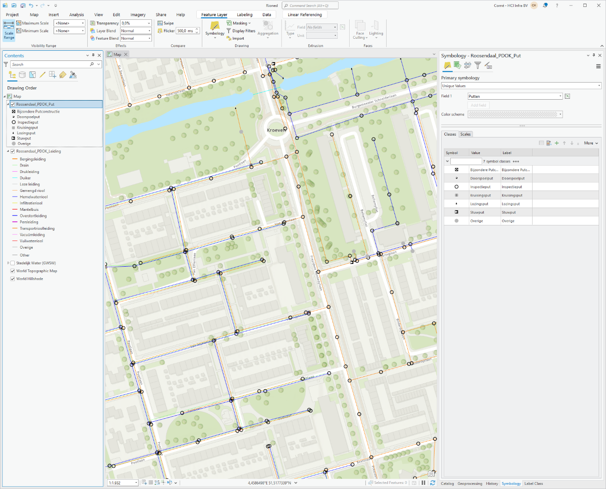

### Testen met WFS

Voor testwerk kan ook de \"count\" parameter aan de WFS-URL worden
toegevoegd. Deze parameter

bepaalt het maximum aantal in te lezen features per GIS-laag. In QGIS
wordt die parameter als volgt meegegeven:

### Publicatie via PDOK

Alvorens een dataset van een gemeente wordt toegevoegd aan de lijst voor
doorlevering naar PDOK, wordt eerst getest of het bestand correct kan
worden omgezet naar gpkg-bestand op basis van het GWSW-Geo thema Beheer.

De GWSW Server levert periodiek de gewijzigde datasets aan de PDOK
Server, dit bestand bevat alle datasets waarvan de eigenaar publicatie
op PDOK heeft toegestaan.

Zodra er een nieuwe upload is gedaan wordt dezelfde avond (om 23:00h)
een nieuw Geopackage aan PDOK aangeboden.

Zie verder <https://www.pdok.nl/viewer/> , selecteer daar de dataset
\"Stedelijk Water (ook riolering)\". De gegevens worden zichtbaar na
voldoende inzoomen, bijvoorbeeld op de gemeente Den Haag of Utrecht.

## Presenteren Nulmeting-resultaat

Met behulp van de GWSW Apps kan de gegevenskwaliteit getoetst worden aan
de kwaliteitsnormen die in de GWSW Ontologie zijn opgenomen.

De toetsing van de kwaliteit gebeurt binnen een bepaald
toepassingsgebied. Binnen het GWSW wordt dit aangeduid met de
"conformiteitsklasse". Een verzoek aan de GWSW-server voor de nulmeting
gebeurt op [https://apps.gwsw.nl/](http://apps.gwsw.nl/)

De resultaten van de nulmeting kunnen vervolgens via GWSW Geo in
geografische vorm worden getoond. Gebruik daarvoor in een GIS-systeem de
volgende wfs-aanroep:

https://geodata.gwsw.nl/{dataset}/nulmeting

De parameter {dataset} is de naam van de dataset waarop de Nulmeting is
uitgevoerd. De procedure is identiek aan het eerder behandelde
wfs-protocol. De URL wordt na afronding van de GWSW Nulmeting op de
website [https://apps.gwsw.nl](http://apps.gwsw.nl) getoond. Het
eenvoudigste is die URL-tekst te kopiëren voor de WFS-aanroep vanuit het
GIS. GWSW Geo gebruikt voor de presentatie het nulmeting-rapport, dat is
een database met onder andere resultaten per geo-object. Zo\'n rapport
wordt naar verloop van tijd opgeruimd, in dat geval is vooraf een nieuwe
nulmeting noodzakelijk.

## Publiceren van GWSW dataset op PDOK

Op de GWSW-server wordt dagelijks een scan uitgevoerd voor bestanden die
in aanmerking komen voor een upload naar PDOK. Het gaat hier om
.ttl-bestanden van gemeenten die toestemming hebben gegeven om de data
op PDOK beschikbaar te stellen. De scan wordt door de app GwswServer
(Javascript "GwswServer.js" in de submap
C:\\MiscApps\\NodejsApps\\NodejsGWSW) uitgevoerd op de data in de
GraphDB database. Binnen de GraphDB database is een gebruiker aangemaakt
met de naam "PDOK". De app GwswServer identificeert de GWSW Datasets
waarop de gebruiker "PDOK" leesrechten heeft gekregen.

Nadat de bestanden door de app GwswServer voor upload zijn
geïdentificeerd worden deze geconverteerd naar het .gpkg-formaat. Daarna
worden de bestand samengebracht in één bestand. Dit is één .gpkg-bestand
waarin de bestanden van meerdere gemeenten kunnen worden ondergebracht.
Het gezamenlijke .gpkg-bestand wordt klaargezet op de GWSW-server voor
upload naar PDOK. (Vanuit de optiek van PDOK-server betreft dit een
download naar PDOK) De download wordt door PDOK gestart, zodra de app
GwswServer een verzoek daartoe verstuurt. D.w.z. de app GwswServer
stuurt het verzoek en PDOK initieert vervolgens de download. Dit gebeurt
op een rustig tijdstip (rond 23:00 uur) PDOK stuurt bericht terug dat de
download geslaagd is.

De GraphDB-Administrator (Admin) stelt de rechten in voor de gebruikers
van de GraphDB database, waaronder de rechten van de gebruiker "PDOK".
Wanneer een gemeente toestemming geeft om hun dataset te publiceren op
PDOK, krijgt de gebruiker "PDOK" leesrechten op het betreffende bestand.
De procedure voor Admin om gebruikersrechten toe te kennen aan
gebruikers, is beschreven in hoofdstuk 3.3.2

### Testen van een nieuwe dataset voorafgaand aan de doorlevering naar PDOK

Alvorens een dataset van een gemeente wordt toegevoegd aan de lijst voor
doorlevering naar PDOK, wordt eerst getest of het bestand kan worden
omgezet naar gpkg-bestand. Nadat het nieuwe gpkg-bestand is gecreëerd,
wordt dit bestand ter controle ingelezen binnen een GIS-applicatie. Het
gpkg-bestand wordt aangemaakt met de apps GWSW Geo op de GWSW-website
met de URL https://apps.gwsw.nl Vervolgens wordt het gpkg-bestand getest
met de applicatie QGIS. De volgende acties worden uitgevoerd om het
gpkg-bestand te creëren:

1\. Op de startpagina van https://apps.gwsw.nl wordt het veld \<Geef de
naam van de dataset\>

> ingevuld met de bestandsnaam van de betreffende gemeente. (Doorgaans
> is de bestandsnaam\
> gelijk aan de naam van de gemeente)

2\. Nadat het bestand is herkend, verschijnt onder dit veld de tekst
\<Dataset aanwezig\>. In de\
menubalk van de startpagina kan nu de apps \<GWSW Geo\> worden geopend.

3\. Op de webpagina van GWSW Geo wordt binnen het veld \<Geef de naam
van de dataset\> de\
bestandnaam van de gemeente, die is ingevoerd op de vorige webpagina,
automatische ingevuld. Wanneer dit niet gebeurt, kan de naam van het
bestand handmatig worden ingevoerd in dit veld.

4\. Nadat de bestandsnaam in het veld \<Geef de naam van de dataset\> is
ingevuld, worden de twee\
keuzes gemaakt om het juiste gpkg-bestand te genereren: Dit zijn:

> \- Toe te passen geo-thema: \<Beheer\>
>
> \- Type geografisch bestand: \<GeoPackage (gpkg)\>

5\. Het button \<Download geo-bestand\> wordt geactiveerd. Het
gpkg-bestand wordt aangemaakt\
en overgebracht naar de download-submap op het systeem van de beheerder.

Het nieuwe gpkg-bestand wordt nu gecontroleerd door dit in te lezen
binnen de GIS-applicatie QGIS. In het hoofdmenu van QGIS wordt gekozen
voor \<Kaartlagen\>. Vanuit dit submenu wordt gekozen voor \<Laag
toevoegen\> en \<Vectorlaag toevoegen\> In het submenu \<Vectorlaag
toevoegen\> wordt de bestandsnaam van het gpkg-bestand ingevoerd binnen
het veld \<Dataset\>. Vervolgens wordt het button \<Open\> geactiveerd.
Hierna verschijnt het submenu \<Selecteer toe te voegen vectorlagen\>.
In dit submenu wordt gekozen voor \<Alles selecteren\> en \<OK\>. Het
gpkg-bestand wordt ingelezen binnen QGIS en de gekozen vectorlagen
verschijnen in de linker menubalk. Het gpkg-bestand kan nu zichtbaar
worden gemaakt binnen QGIS.

### Toekennen gebruikersrechten aan gebruiker "PDOK"

De GraphDB-Administrator (admin) kent de leesrechten toe aan
GWSW-gebruiker "PDOK". Alle nieuwe en gewijzigde datasets waar de
gebruiker "PDOK" leesrechten heeft gekregen, worden uitgeleverd aan
PDOK. De volgende acties worden uitgevoerd om een dataset toe te voegen
aan de lijst voor uitlevering naar PDOK:

1\. Er wordt aangelogd op GraphDB als Admin

\- Start : https://sparql.gwsw.nl \<Login\>

\- Gebruikersnaam : admin

\- Wachtwoord :

2\. Selecteer in linker menu \<Users and Access\>

3\. Zoek op deze webpagina in de kolom Username naar het user-id naar
"PDOK". Ga in de regel van het user-id "PDOK" naar \<Edit user\>.
Vervolgens komt men op de webpagina "Edit user: PDOK" / "Repository
rights".

4\. Zoek binnen "Repository rights" naar de naam van de nieuwe dataset.
Hier worden twee buttons weergegeven voor respectievelijk de "read" en
"write" rechten van het user-id "PDOK" op de nieuwe dataset.

5\. Markeer het button voor "read" rechten (geef "read" rechten aan het
user-id "PDOK") en ga naar linksonder op deze webpagina.

6\. Selecteer \<Save\> om de rechten voor "PDOK" op te slaan.
Rechtsonder op de webpagina verschijnt de mededeling "The user-id PDOK
was updated".

# Bijlage: Inventarisatie gebruikte symbolen {#bijlage-inventarisatie-gebruikte-symbolen .unnumbered}

Er is geen nationale concensus over de toepassing van standaardsymbolen
voor de objecttypes Stedelijk Water. Er zijn dan ook veel verschillende
symboolsets in gebruik. De NLCS geldt als CAD standaard voor de
Nederlandse GWW-sector maar wordt in de stedelijk water wereld
nauwelijks toegepast.

In de volgende tabellen zijn de te onderscheiden objecttypes opgenomen
met daarbij voorbeelden van de gebruikte symbolen.

*Tabel: Soorten put*

<table>
<colgroup>
<col style="width: 17%" />
<col style="width: 17%" />
<col style="width: 9%" />
<col style="width: 9%" />
<col style="width: 9%" />
<col style="width: 9%" />
<col style="width: 9%" />
<col style="width: 9%" />
<col style="width: 9%" />
</colgroup>
<thead>
<tr class="header">
<th>Soorten put GWSW</th>
<th>Veel gebruikte objectnamen in GIS</th>
<th>NLCS</th>
<th>Rotter-dam</th>
<th>Antea Group</th>
<th>HHNK</th>
<th>
Lizard

(gebaseerd op Aquo standaard)
</th>
<th>Den Haag</th>
<th>Sweco</th>
</tr>
</thead>
<tbody>
<tr class="odd">
<td>
Overstortput

(supertype)
</td>
<td>Overstortput</td>
<td>B-SRI-PUT_OVERSTORT-SO.dwg</td>
<td></td>
<td>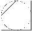</td>
<td>(zelfde)</td>
<td></td>
<td>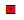</td>
<td></td>
</tr>
<tr class="even">
<td>
Pompput

(supertype van Pompunit)
</td>
<td>Pompput</td>
<td>B-SRI-PUT_POMPPUT-SO.dwg</td>
<td></td>
<td></td>
<td>(zelfde)</td>
<td> (zelfde)</td>
<td>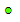</td>
<td></td>
</tr>
<tr class="odd">
<td>Infiltratieput</td>
<td>Infiltratieput</td>
<td>Niet aanwezig</td>
<td></td>
<td></td>
<td>-</td>
<td>-</td>
<td>-</td>
<td></td>
</tr>
<tr class="even">
<td>?</td>
<td>Koppelput</td>
<td>B-SRI-PUT_KOPPELPUT-SO.dwg</td>
<td></td>
<td></td>
<td>-</td>
<td>-</td>
<td></td>
<td></td>
</tr>
<tr class="odd">
<td>
Rioolput

(supertype)
</td>
<td>Put</td>
<td>B-SRI-PUT_KUNSTSTOF-SO.dwg</td>
<td></td>
<td></td>
<td>-</td>
<td></td>
<td></td>
<td></td>
</tr>
<tr class="even">
<td>Overnamepunt</td>
<td>Overnamepunt</td>
<td>Niet aanwezig</td>
<td></td>
<td></td>
<td></td>
<td>-</td>
<td>-</td>
<td></td>
</tr>
<tr class="odd">
<td>Inspectieput</td>
<td>Inspectieput (persleiding)</td>
<td>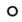SRI-PUT_INSPECTIE-SO.dwg</td>
<td> Knooppunt riolering</td>
<td></td>
<td></td>
<td>-</td>
<td>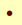</td>
<td></td>
</tr>
<tr class="even">
<td>Beerput</td>
<td></td>
<td></td>
<td></td>
<td></td>
<td></td>
<td></td>
<td></td>
<td></td>
</tr>
<tr class="odd">
<td>Doorspoelput</td>
<td></td>
<td></td>
<td></td>
<td></td>
<td></td>
<td></td>
<td></td>
<td></td>
</tr>
<tr class="even">
<td>Drainageput</td>
<td></td>
<td></td>
<td>

Knooppunt drainage
</td>
<td></td>
<td></td>
<td></td>
<td></td>
<td></td>
</tr>
<tr class="odd">
<td>Erfafscheidingsput</td>
<td></td>
<td></td>
<td></td>
<td></td>
<td></td>
<td></td>
<td></td>
<td></td>
</tr>
<tr class="even">
<td>Externe overstortput</td>
<td>Externe Overstortput</td>
<td>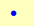 B-SRI-PUT_OVERSTORT-SO.dwg</td>
<td></td>
<td></td>
<td></td>
<td>
 rood = met meting

 zwart = zonder meting
</td>
<td></td>
<td></td>
</tr>
<tr class="odd">
<td>Filterput</td>
<td></td>
<td></td>
<td></td>
<td></td>
<td></td>
<td></td>
<td></td>
<td></td>
</tr>
<tr class="even">
<td>Interne overstortput</td>
<td>Interne Overstort</td>
<td>B-SRI-PUT_OVERSTORT-SO.dwg</td>
<td></td>
<td></td>
<td>(zelfde)</td>
<td>(zelfde)</td>
<td></td>
<td></td>
</tr>
<tr class="odd">
<td>Stuwput</td>
<td></td>
<td></td>
<td></td>
<td></td>
<td></td>
<td></td>
<td></td>
<td></td>
</tr>
<tr class="even">
<td>Kolk</td>
<td></td>
<td></td>
<td></td>
<td></td>
<td></td>
<td></td>
<td> </td>
<td></td>
</tr>
<tr class="odd">
<td>Kruisingsput</td>
<td></td>
<td></td>
<td>

Kruisput
</td>
<td></td>
<td></td>
<td></td>
<td></td>
<td></td>
</tr>
<tr class="even">
<td>Lozingsput</td>
<td></td>
<td></td>
<td></td>
<td></td>
<td></td>
<td></td>
<td></td>
<td></td>
</tr>
<tr class="odd">
<td>Noodoverstortput</td>
<td></td>
<td></td>
<td></td>
<td></td>
<td></td>
<td></td>
<td></td>
<td></td>
</tr>
<tr class="even">
<td>Ontstoppingsput</td>
<td></td>
<td></td>
<td></td>
<td></td>
<td></td>
<td></td>
<td></td>
<td></td>
</tr>
<tr class="odd">
<td>Pompunit</td>
<td></td>
<td></td>
<td></td>
<td></td>
<td></td>
<td></td>
<td></td>
<td></td>
</tr>
<tr class="even">
<td>Reinigende put</td>
<td></td>
<td></td>
<td></td>
<td></td>
<td></td>
<td></td>
<td></td>
<td></td>
</tr>
<tr class="odd">
<td>Slokop</td>
<td></td>
<td></td>
<td></td>
<td></td>
<td></td>
<td></td>
<td></td>
<td></td>
</tr>
<tr class="even">
<td>Vacuümopslagtank</td>
<td></td>
<td></td>
<td></td>
<td></td>
<td></td>
<td></td>
<td></td>
<td></td>
</tr>
<tr class="odd">
<td>Verbeterde overstortput</td>
<td></td>
<td></td>
<td></td>
<td></td>
<td></td>
<td></td>
<td></td>
<td></td>
</tr>
<tr class="even">
<td>Wervelput</td>
<td></td>
<td></td>
<td>

Wervelventiel
</td>
<td></td>
<td></td>
<td></td>
<td></td>
<td></td>
</tr>
<tr class="odd">
<td>Zinkerput</td>
<td></td>
<td></td>
<td></td>
<td></td>
<td></td>
<td></td>
<td></td>
<td></td>
</tr>
<tr class="even">
<td>Verdekte put</td>
<td></td>
<td></td>
<td>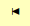</td>
<td></td>
<td></td>
<td></td>
<td></td>
<td></td>
</tr>
<tr class="odd">
<td>?</td>
<td>Berry</td>
<td></td>
<td></td>
<td></td>
<td></td>
<td></td>
<td></td>
<td></td>
</tr>
<tr class="even">
<td>?</td>
<td>Buiten bedrijf</td>
<td></td>
<td></td>
<td></td>
<td></td>
<td></td>
<td></td>
<td></td>
</tr>
<tr class="odd">
<td>? Perceelaansluitpunt</td>
<td></td>
<td></td>
<td>

Inprikpunt
</td>
<td></td>
<td></td>
<td></td>
<td></td>
<td></td>
</tr>
<tr class="even">
<td>Uitlaatpunt</td>
<td></td>
<td></td>
<td>
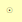

Uitstroompunt
</td>
<td></td>
<td></td>
<td></td>
<td></td>
<td></td>
</tr>
<tr class="odd">
<td>?</td>
<td>Nog te verwerken</td>
<td></td>
<td>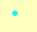</td>
<td></td>
<td></td>
<td></td>
<td></td>
<td></td>
</tr>
<tr class="even">
<td>?</td>
<td>Particulier</td>
<td></td>
<td></td>
<td></td>
<td></td>
<td></td>
<td></td>
<td></td>
</tr>
<tr class="odd">
<td></td>
<td></td>
<td></td>
<td></td>
<td></td>
<td></td>
<td></td>
<td></td>
<td></td>
</tr>
</tbody>
</table>

*Tabel: Soorten onderdeel*

<table>
<colgroup>
<col style="width: 17%" />
<col style="width: 17%" />
<col style="width: 9%" />
<col style="width: 9%" />
<col style="width: 9%" />
<col style="width: 9%" />
<col style="width: 9%" />
<col style="width: 9%" />
<col style="width: 9%" />
</colgroup>
<thead>
<tr class="header">
<th>Soorten onderdeel GWSW</th>
<th>Veel gebruikte objectnamen in GIS</th>
<th>NLCS</th>
<th>Rotter-dam</th>
<th>Antea Group</th>
<th>HHNK</th>
<th>
Lizard

(gebaseerd op Aquo standaard)
</th>
<th>Den Haag</th>
<th>Sweco</th>
</tr>
</thead>
<tbody>
<tr class="odd">
<td>Afsluiter</td>
<td>Afsluiter</td>
<td>SRI-HULP_AFSLUITER-SO.dwg</td>
<td></td>
<td></td>
<td></td>
<td>-</td>
<td></td>
<td>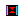</td>
</tr>
<tr class="even">
<td>Ontluchtingsventiel</td>
<td>Ontluchtingsput</td>
<td>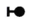SRI-HULP_ONTLUCHTING-SO.dwg Polyline</td>
<td></td>
<td></td>
<td></td>
<td>-</td>
<td></td>
<td></td>
</tr>
<tr class="odd">
<td>Mangat</td>
<td>Mangat (persleiding)</td>
<td>Niet aanwezig</td>
<td></td>
<td></td>
<td></td>
<td>-</td>
<td></td>
<td></td>
</tr>
<tr class="even">
<td>Verbindingsstuk</td>
<td>Koppelstuk</td>
<td>Niet aanwezig</td>
<td></td>
<td></td>
<td></td>
<td>-</td>
<td>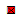</td>
<td></td>
</tr>
<tr class="odd">
<td>Regenmeter</td>
<td>Neerslagmeter</td>
<td></td>
<td></td>
<td></td>
<td></td>
<td></td>
<td></td>
<td></td>
</tr>
<tr class="even">
<td>Waterniveaumeter</td>
<td>Niveaumeter</td>
<td></td>
<td></td>
<td></td>
<td></td>
<td></td>
<td></td>
<td></td>
</tr>
<tr class="odd">
<td>Debietmeter</td>
<td>Debietmeter</td>
<td></td>
<td></td>
<td></td>
<td></td>
<td></td>
<td></td>
<td></td>
</tr>
<tr class="even">
<td>Ontstoppingsstuk</td>
<td>Ontstoppingsstuk</td>
<td></td>
<td></td>
<td></td>
<td></td>
<td></td>
<td> </td>
<td></td>
</tr>
<tr class="odd">
<td></td>
<td></td>
<td></td>
<td></td>
<td></td>
<td></td>
<td></td>
<td></td>
<td></td>
</tr>
</tbody>
</table>

*Tabel: Soorten bouwwerk*

<table>
<colgroup>
<col style="width: 17%" />
<col style="width: 17%" />
<col style="width: 9%" />
<col style="width: 9%" />
<col style="width: 9%" />
<col style="width: 9%" />
<col style="width: 9%" />
<col style="width: 9%" />
<col style="width: 9%" />
</colgroup>
<thead>
<tr class="header">
<th>Soorten bouwwerk GWSW</th>
<th>Veel gebruikte objectnamen in GIS</th>
<th>NLCS</th>
<th>Rotter-dam</th>
<th>Antea Group</th>
<th>HHNK</th>
<th>
Lizard

(gebaseerd op Aquo standaard)
</th>
<th>Den Haag</th>
<th>Sweco</th>
</tr>
</thead>
<tbody>
<tr class="odd">
<td>Bergbezinkbassin</td>
<td></td>
<td></td>
<td></td>
<td></td>
<td></td>
<td></td>
<td></td>
<td></td>
</tr>
<tr class="even">
<td>Bergingsbassin</td>
<td></td>
<td></td>
<td></td>
<td></td>
<td></td>
<td></td>
<td></td>
<td></td>
</tr>
<tr class="odd">
<td>Bergingsvijver</td>
<td></td>
<td></td>
<td></td>
<td></td>
<td></td>
<td></td>
<td></td>
<td></td>
</tr>
<tr class="even">
<td>Bezinkbassin</td>
<td></td>
<td></td>
<td></td>
<td></td>
<td></td>
<td></td>
<td></td>
<td></td>
</tr>
<tr class="odd">
<td>IBA</td>
<td></td>
<td></td>
<td></td>
<td></td>
<td></td>
<td></td>
<td></td>
<td></td>
</tr>
<tr class="even">
<td>Infiltratiereservoir</td>
<td></td>
<td></td>
<td></td>
<td></td>
<td></td>
<td></td>
<td></td>
<td></td>
</tr>
<tr class="odd">
<td>Nooduitlaat</td>
<td></td>
<td></td>
<td></td>
<td></td>
<td></td>
<td></td>
<td></td>
<td></td>
</tr>
<tr class="even">
<td>Open berging</td>
<td></td>
<td></td>
<td></td>
<td></td>
<td></td>
<td></td>
<td></td>
<td></td>
</tr>
<tr class="odd">
<td>
Uitlaatconstructie

Uitlaat (punt)
</td>
<td>Hemelwateruitlaat</td>
<td>B-SRI-PUT_HWA-SO.dwg</td>
<td></td>
<td></td>
<td></td>
<td>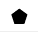</td>
<td>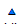</td>
<td></td>
</tr>
<tr class="even">
<td>Open berging</td>
<td></td>
<td></td>
<td></td>
<td></td>
<td></td>
<td></td>
<td></td>
<td></td>
</tr>
<tr class="odd">
<td>Rioolgemaal</td>
<td>Rioolgemaal (Waterschap)</td>
<td>V-SRI-GEMAAL-SO.dwg</td>
<td></td>
<td></td>
<td>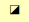</td>
<td></td>
<td></td>
<td></td>
</tr>
<tr class="even">
<td>Rioolgemaal</td>
<td>Rioolgemaal (gemeente)</td>
<td>V-SRI-GEMAAL-SO.dwg</td>
<td></td>
<td></td>
<td></td>
<td></td>
<td></td>
<td></td>
</tr>
<tr class="odd">
<td>RWZI</td>
<td>Zuivering</td>
<td>Niet aanwezig</td>
<td></td>
<td></td>
<td></td>
<td></td>
<td>-</td>
<td></td>
</tr>
<tr class="even">
<td></td>
<td></td>
<td></td>
<td></td>
<td></td>
<td></td>
<td></td>
<td></td>
<td></td>
</tr>
<tr class="odd">
<td></td>
<td></td>
<td></td>
<td></td>
<td></td>
<td></td>
<td></td>
<td></td>
<td></td>
</tr>
</tbody>
</table>

*Tabel: Soorten leiding*

<table>
<colgroup>
<col style="width: 17%" />
<col style="width: 17%" />
<col style="width: 9%" />
<col style="width: 9%" />
<col style="width: 9%" />
<col style="width: 9%" />
<col style="width: 9%" />
<col style="width: 9%" />
<col style="width: 9%" />
</colgroup>
<thead>
<tr class="header">
<th>Soorten bouwwerk GWSW</th>
<th>Veel gebruikte objectnamen in GIS</th>
<th>NLCS</th>
<th>Rotter-dam</th>
<th>Antea Group</th>
<th>HHNK</th>
<th>
Lizard

(gebaseerd op Aquo standaard)
</th>
<th>Den Haag</th>
<th>Sweco</th>
</tr>
</thead>
<tbody>
<tr class="odd">
<td>Bergbezinkleiding</td>
<td></td>
<td></td>
<td></td>
<td></td>
<td></td>
<td></td>
<td></td>
<td></td>
</tr>
<tr class="even">
<td>Bergingsleiding</td>
<td></td>
<td></td>
<td></td>
<td></td>
<td></td>
<td></td>
<td></td>
<td></td>
</tr>
<tr class="odd">
<td>Drain</td>
<td></td>
<td></td>
<td></td>
<td></td>
<td></td>
<td></td>
<td></td>
<td></td>
</tr>
<tr class="even">
<td>Drukleiding</td>
<td></td>
<td></td>
<td></td>
<td></td>
<td></td>
<td></td>
<td></td>
<td></td>
</tr>
<tr class="odd">
<td>Duiker</td>
<td></td>
<td></td>
<td></td>
<td></td>
<td></td>
<td></td>
<td></td>
<td></td>
</tr>
<tr class="even">
<td>DWA perceelaansluitleiding</td>
<td></td>
<td></td>
<td></td>
<td></td>
<td></td>
<td></td>
<td></td>
<td></td>
</tr>
<tr class="odd">
<td>Gemengd riool</td>
<td></td>
<td></td>
<td></td>
<td></td>
<td></td>
<td></td>
<td></td>
<td></td>
</tr>
<tr class="even">
<td>Gemengde perceelaansluitleiding</td>
<td></td>
<td></td>
<td></td>
<td></td>
<td></td>
<td></td>
<td></td>
<td></td>
</tr>
<tr class="odd">
<td>Goot</td>
<td></td>
<td></td>
<td></td>
<td></td>
<td></td>
<td></td>
<td></td>
<td></td>
</tr>
<tr class="even">
<td>Hemelwaterriool</td>
<td></td>
<td></td>
<td></td>
<td></td>
<td></td>
<td></td>
<td></td>
<td></td>
</tr>
<tr class="odd">
<td>HWA perceelaansluitleiding</td>
<td></td>
<td></td>
<td></td>
<td></td>
<td></td>
<td></td>
<td></td>
<td></td>
</tr>
<tr class="even">
<td>Infiltratieriool</td>
<td></td>
<td></td>
<td>

DIT/DT/Infiltratie-riool
</td>
<td></td>
<td></td>
<td></td>
<td></td>
<td></td>
</tr>
<tr class="odd">
<td>Kolkaansluitleiding</td>
<td></td>
<td></td>
<td></td>
<td></td>
<td></td>
<td></td>
<td></td>
<td></td>
</tr>
<tr class="even">
<td>Lijnafwatering</td>
<td></td>
<td></td>
<td></td>
<td></td>
<td></td>
<td></td>
<td></td>
<td></td>
</tr>
<tr class="odd">
<td>Loze leiding</td>
<td></td>
<td></td>
<td>

Buiten bedrijf
</td>
<td></td>
<td></td>
<td></td>
<td></td>
<td></td>
</tr>
<tr class="even">
<td>Mantelbuis</td>
<td></td>
<td></td>
<td></td>
<td></td>
<td></td>
<td></td>
<td></td>
<td></td>
</tr>
<tr class="odd">
<td>Ontluchtingsleiding</td>
<td></td>
<td></td>
<td></td>
<td></td>
<td></td>
<td></td>
<td></td>
<td></td>
</tr>
<tr class="even">
<td>Overstortleiding</td>
<td></td>
<td></td>
<td></td>
<td></td>
<td></td>
<td></td>
<td></td>
<td></td>
</tr>
<tr class="odd">
<td>Persleiding</td>
<td></td>
<td></td>
<td></td>
<td></td>
<td></td>
<td></td>
<td></td>
<td>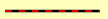</td>
</tr>
<tr class="even">
<td>Spoelleiding</td>
<td></td>
<td></td>
<td></td>
<td></td>
<td></td>
<td></td>
<td></td>
<td></td>
</tr>
<tr class="odd">
<td>Stuwrioolleiding</td>
<td></td>
<td></td>
<td></td>
<td></td>
<td></td>
<td></td>
<td></td>
<td></td>
</tr>
<tr class="even">
<td>Transportrioolleiding</td>
<td></td>
<td></td>
<td></td>
<td></td>
<td></td>
<td></td>
<td></td>
<td></td>
</tr>
<tr class="odd">
<td>Vacuümleiding</td>
<td></td>
<td></td>
<td></td>
<td></td>
<td></td>
<td></td>
<td></td>
<td></td>
</tr>
<tr class="even">
<td>Vuilwaterriool</td>
<td></td>
<td></td>
<td></td>
<td></td>
<td></td>
<td></td>
<td></td>
<td></td>
</tr>
<tr class="odd">
<td>Zinker</td>
<td></td>
<td></td>
<td></td>
<td></td>
<td></td>
<td></td>
<td></td>
<td></td>
</tr>
<tr class="even">
<td>?</td>
<td>Gerelined</td>
<td></td>
<td></td>
<td></td>
<td></td>
<td></td>
<td></td>
<td></td>
</tr>
<tr class="odd">
<td>?</td>
<td>Particulier</td>
<td></td>
<td></td>
<td></td>
<td></td>
<td></td>
<td></td>
<td></td>
</tr>
<tr class="even">
<td>?</td>
<td>Brandblusleiding</td>
<td></td>
<td></td>
<td></td>
<td></td>
<td></td>
<td></td>
<td></td>
</tr>
<tr class="odd">
<td>?</td>
<td>Vuil, onderheid</td>
<td></td>
<td></td>
<td></td>
<td></td>
<td></td>
<td></td>
<td></td>
</tr>
<tr class="even">
<td>?</td>
<td>Regenwater, onderheid</td>
<td></td>
<td>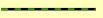</td>
<td></td>
<td></td>
<td></td>
<td></td>
<td></td>
</tr>
<tr class="odd">
<td>? Duiker</td>
<td>Singelverbinding</td>
<td></td>
<td></td>
<td></td>
<td></td>
<td></td>
<td></td>
<td></td>
</tr>
<tr class="even">
<td>? Duiker</td>
<td>Singelverbinding, onderheid</td>
<td></td>
<td></td>
<td></td>
<td></td>
<td></td>
<td></td>
<td></td>
</tr>
<tr class="odd">
<td>?</td>
<td>Spuileiding</td>
<td></td>
<td>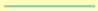</td>
<td></td>
<td></td>
<td></td>
<td></td>
<td></td>
</tr>
<tr class="even">
<td>?</td>
<td>Spuileiding, onderheid</td>
<td></td>
<td></td>
<td></td>
<td></td>
<td></td>
<td></td>
<td></td>
</tr>
<tr class="odd">
<td>?</td>
<td>Revisie in verwerking</td>
<td></td>
<td></td>
<td></td>
<td></td>
<td></td>
<td></td>
<td></td>
</tr>
<tr class="even">
<td>?</td>
<td>Buiten bedrijf, onderheid</td>
<td></td>
<td></td>
<td></td>
<td></td>
<td></td>
<td></td>
<td></td>
</tr>
<tr class="odd">
<td>?</td>
<td>Gemengd riool, geprojecteerd</td>
<td></td>
<td></td>
<td></td>
<td></td>
<td></td>
<td></td>
<td></td>
</tr>
<tr class="even">
<td>?</td>
<td>Hemelwaterriool, geprojecteerd</td>
<td></td>
<td></td>
<td></td>
<td></td>
<td></td>
<td></td>
<td></td>
</tr>
<tr class="odd">
<td>?</td>
<td>Vuilwaterriool, geprojecteerd</td>
<td></td>
<td></td>
<td></td>
<td></td>
<td></td>
<td></td>
<td>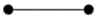</td>
</tr>
<tr class="even">
<td></td>
<td></td>
<td></td>
<td></td>
<td></td>
<td></td>
<td></td>
<td></td>
<td></td>
</tr>
</tbody>
</table>
